# Intelligent Time-Series Forecasting and Anomaly Detection Using Statistical, Machine Learning and Deep Learning Methods

## Abstract

Time-series data are continuously generated by modern systems such as cloud infrastructure, industrial equipment, Internet of Things (IoT) devices, financial systems, and computer networks. Identifying abnormal behavior in such data is important because anomalies may indicate system failures, performance degradation, unexpected changes, or other unusual system conditions.

This project develops an intelligent framework for time-series forecasting and anomaly detection by combining statistical, machine learning, deep learning, and hybrid approaches. The Numenta Anomaly Benchmark (NAB) dataset is used for the experimental study, with the EC2 CPU Utilization time series selected as the primary dataset.

The project begins with exploratory time-series analysis to understand the statistical and temporal characteristics of the data. This includes distribution analysis, rolling statistics, autocorrelation and partial autocorrelation analysis, and stationarity testing. A simple Naive forecasting method is first established as a baseline and is then compared with an ARIMA forecasting model.

For anomaly detection, three different approaches are investigated. ARIMA residual-based detection identifies observations that deviate significantly from their forecasted values. Isolation Forest uses statistical and temporal features to identify unusual observations. An LSTM Autoencoder learns normal temporal patterns and identifies observations with high reconstruction error. In addition, hybrid approaches are developed by combining anomaly evidence from multiple models.

The models are evaluated using point-level precision, recall, F1-score and ROC-AUC, along with anomaly-window and event-level evaluation. The experimental results demonstrate that different models have different strengths. ARIMA residual-based detection achieves the strongest point-level performance, obtaining a point F1-score of 0.1600 and ROC-AUC of 0.9981. The LSTM Autoencoder achieves the highest window-level F1-score of 0.1327, while detecting 50% of the major anomaly events. Isolation Forest V2 and the hybrid approaches provide complementary anomaly detection behavior and successfully detect both major anomaly events.

Finally, the developed methodology is integrated into an interactive Streamlit dashboard. The dashboard enables users to explore forecasting results, anomaly detections, anomaly scores, model agreement, and comparative model performance.

---

# 1. Introduction

## 1.1 Background

Time-series analysis is the study of observations collected sequentially over time. Unlike ordinary independent observations, time-series observations are often dependent on previous observations. This temporal dependency makes time-series analysis an important area of statistics, machine learning, and data science.

Many real-world systems generate time-series data continuously. For example, cloud computing platforms record CPU utilization, memory usage, network traffic, and system response times. Monitoring such variables helps organizations understand system behavior and identify abnormal operating conditions.

One important task in time-series analysis is forecasting. Forecasting attempts to estimate future observations based on previously observed data. Another important task is anomaly detection, where the objective is to identify observations or periods that differ significantly from normal behavior.

These two tasks are closely related. If a forecasting model can estimate what the system should normally look like, large deviations between the observed and forecasted values can provide useful evidence of anomalous behavior.

However, no single anomaly detection technique is guaranteed to work well for every type of time-series data. Statistical approaches can be effective for simple temporal patterns, while machine learning methods can identify unusual combinations of features. Deep learning methods can learn more complex temporal representations. Therefore, comparing multiple approaches can provide a more complete understanding of anomaly detection performance.

---

## 1.2 Problem Statement

Cloud infrastructure produces large volumes of monitoring data in the form of time series. Although most observations correspond to normal system behavior, abnormal periods can occur due to unexpected workload changes, system problems, configuration issues, or other events.

Simple fixed-threshold monitoring approaches may not be sufficient because time-series data can contain temporal dependencies, changing variability, and complex patterns. An observation that appears unusual in isolation may be normal in a particular temporal context, while a subtle deviation from expected behavior may indicate an anomaly.

Therefore, this project investigates how statistical forecasting, machine learning, deep learning, and hybrid techniques can be used to identify anomalous behavior in cloud CPU-utilization time-series data.

The central problem addressed by this project is:

> **How effectively can statistical, machine learning, deep learning, and hybrid approaches forecast time-series behavior and detect anomalous observations in cloud infrastructure data?**

---

## 1.3 Objectives

The major objectives of this project are:

1. To understand the temporal and statistical characteristics of cloud CPU-utilization time-series data.

2. To perform exploratory time-series analysis, including distribution analysis, rolling statistics, autocorrelation, partial autocorrelation, and stationarity testing.

3. To establish a simple Naive forecasting method as a baseline.

4. To develop an ARIMA forecasting model and evaluate its forecasting performance.

5. To investigate ARIMA residuals as an approach for anomaly detection.

6. To apply Isolation Forest using temporal and statistical features for unsupervised anomaly detection.

7. To develop an LSTM Autoencoder for detecting anomalies using reconstruction error.

8. To develop hybrid anomaly detection approaches by combining evidence from multiple detection models.

9. To compare the different models using point-level, window-level, and event-level evaluation measures.

10. To investigate the agreement and complementary behavior of different anomaly detection models.

11. To develop an interactive Streamlit dashboard for visualizing forecasts, anomaly detections, anomaly scores, and model performance.

---

## 1.4 Research Questions

The project investigates the following research questions:

### RQ1
How effectively can statistical methods detect anomalies in time-series data?

### RQ2
Does forecasting-based anomaly detection effectively identify abnormal observations?

### RQ3
How does Isolation Forest compare with forecasting-based anomaly detection?

### RQ4
Can an LSTM Autoencoder detect complex temporal anomalies that may not be captured by statistical methods?

### RQ5
Do different anomaly detection models identify complementary anomalous observations?

### RQ6
Can combining multiple anomaly signals improve anomaly-event detection?

---

## 1.5 Scope of the Project

The scope of this project focuses on the analysis of a cloud infrastructure time series representing EC2 CPU utilization. The project covers data preprocessing, exploratory analysis, forecasting, anomaly detection, model comparison, explainability through model agreement, and interactive visualization.

The project considers both individual anomalous observations and extended anomaly periods. Therefore, evaluation is performed at point level as well as anomaly-window and event level.

The project does not attempt to build a production-grade cloud monitoring system. Instead, it focuses on developing and experimentally comparing different time-series forecasting and anomaly detection methodologies within an academic project setting.

---

# 2. Dataset and Data Preprocessing

## 2.1 Dataset

The Numenta Anomaly Benchmark (NAB) is used as the primary benchmark for the project. NAB contains real and artificial time-series datasets designed for evaluating anomaly detection algorithms.

The selected time series is:

**Dataset:** `realAWSCloudwatch/ec2_cpu_utilization_24ae8d.csv`

The series represents CPU utilization measurements from an Amazon EC2 cloud computing environment.

The original dataset contains **4,032 observations**, with measurements recorded at a regular interval of **5 minutes**.

The selected time series covers the period from:

**14 February 2014 14:30**

to

**28 February 2014 14:25**

Two major anomaly windows are identified in the official NAB annotation.

---

## 2.2 Data Cleaning

The dataset was examined for common data-quality issues before performing the modelling experiments.

The following checks were performed:

- Missing-value detection
- Duplicate-row detection
- Data-type verification
- Timestamp conversion
- Chronological sorting
- Sampling-interval verification

The dataset contains **no missing observations** and **no duplicate rows**. The timestamp column was converted to a datetime representation and the observations were sorted chronologically.

The sampling interval was verified to be consistently equal to **5 minutes**.

---

## 2.3 Train, Validation and Test Split

Because time-series observations are ordered in time, a random train-test split was avoided. Random splitting could introduce future information into the training data and result in data leakage.

A chronological split was therefore used.

The final split consists of:

| Dataset | Observations |
|---|---:|
| Training | 2,419 |
| Validation | 806 |
| Final Test | 807 |

The final test set is used for the primary anomaly-detection evaluation because official NAB anomaly labels are available for this period.

Thresholds for anomaly detection are determined using training data and then kept frozen during final test evaluation.

This prevents information from the final test set from being used to determine anomaly thresholds.

# 3. Exploratory Time-Series Analysis

## 3.1 Overview of the Time Series

Before developing forecasting and anomaly detection models, exploratory analysis was performed to understand the statistical and temporal characteristics of the selected EC2 CPU-utilization time series.

The dataset contains 4,032 observations collected at a regular interval of 5 minutes. The analysis was performed on the chronologically ordered and cleaned time series.

The exploratory analysis focused on:

- Distribution of CPU utilization values
- Central tendency and variability
- Presence of extreme observations
- Rolling statistics
- Autocorrelation
- Partial autocorrelation
- Stationarity

These analyses provide an understanding of the underlying structure of the time series and help guide the selection of appropriate forecasting and anomaly detection methods.

---
#### Figure 1: Time-Series Overview

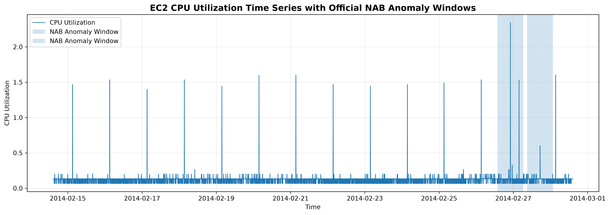

**Figure 1.** EC2 CPU utilization time series with the official Numenta Anomaly Benchmark (NAB) anomaly windows highlighted. The visualization shows the normal operating behavior of the system and the two major anomalous periods used for evaluation.

## 3.2 Descriptive Statistics

The basic statistical characteristics of the CPU-utilization series were examined.

| Statistic | Value |
|---|---:|
| Number of observations | 4,032 |
| Mean | 0.1263 |
| Standard deviation | 0.0948 |
| Minimum | 0.0660 |
| Maximum | 2.3440 |
| Median | 0.1340 |
| 90th percentile | 0.1340 |
| 95th percentile | 0.1360 |
| 99th percentile | 0.2020 |
| 99.5th percentile | 0.2657 |
| 99.9th percentile | 1.5340 |

The mean CPU utilization is approximately 0.1263, while the median is approximately 0.1340. The relatively large difference between the typical observations and the maximum value indicates the presence of unusually large observations.

The maximum value of 2.344 is substantially higher than the normal operating range of most observations. This provides an initial indication that the dataset contains extreme behavior that may correspond to anomalous events.

---
#### Figure 2: Distribution of CPU Utilization

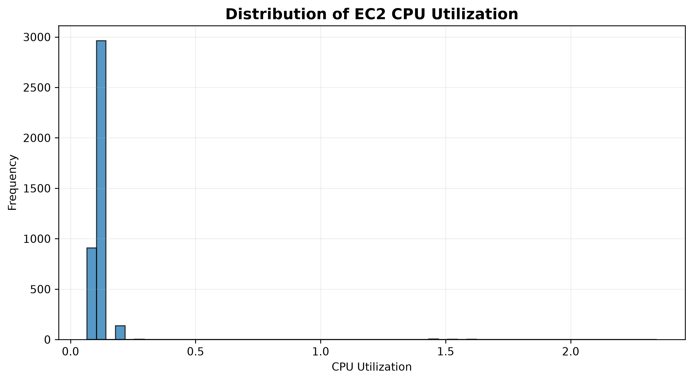

**Figure 2.** Distribution of EC2 CPU utilization values. The distribution is highly right-skewed, with most observations concentrated at low utilization levels and a small number of unusually large values.

## 3.3 Distribution and Outlier Characteristics

The distribution of the CPU-utilization values was also examined using skewness and kurtosis.

The calculated skewness is approximately:

**13.99**

while the kurtosis is approximately:

**230.21**

These values indicate a highly right-skewed and heavy-tailed distribution.

Most observations are concentrated within a relatively narrow range, while a small number of observations have substantially larger values. This behavior is important for anomaly detection because the anomalous observations are not simply small deviations from the mean; some observations represent extreme deviations from the normal operating behavior.

The high skewness also suggests that methods based purely on assumptions of a symmetric or normally distributed signal may not fully describe the extreme behavior of the series.

Therefore, both statistical residual analysis and machine-learning-based approaches were considered in the project.

---

## 3.4 Rolling Statistics

Rolling statistics were used to examine how the local behavior of the time series changes over time.

A rolling window of 24 hours was used. Since the data are sampled every 5 minutes, one day corresponds to:

\[
\frac{24 \times 60}{5} = 288
\]

observations.

Therefore, a rolling window of 288 observations was used to calculate the local rolling mean and rolling standard deviation.

The rolling mean provides an estimate of the local level of CPU utilization, while the rolling standard deviation provides information about local variability.

These rolling statistics are particularly useful for anomaly detection because an observation can be unusual relative to its local context even when it may not appear highly unusual relative to the entire dataset.

The rolling statistics were also used as features for the Isolation Forest models.

---
#### Figure 3: Rolling Statistics

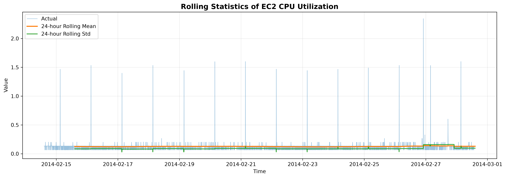

**Figure 3.** Twenty-four-hour rolling mean and rolling standard deviation of EC2 CPU utilization. The rolling statistics help characterize changes in the local behavior and variability of the time series over time.

## 3.5 Autocorrelation Analysis

Autocorrelation analysis was performed to investigate the relationship between observations separated by different time lags.

The Autocorrelation Function (ACF) was examined over multiple lags.

The results indicate that most autocorrelation values become relatively small after the first few lags. However, some spikes are visible around lags approximately 67, 216, and 276–288.

A lag of 288 corresponds to approximately 24 hours because each observation represents 5 minutes.

Although some activity occurs near the daily lag, the ACF does not show a clean and dominant daily periodic pattern across the complete series.

This suggests that the time series contains short-term temporal dependence but does not exhibit a simple deterministic daily seasonal structure.

This observation influenced the forecasting model selection and supported the use of a relatively simple ARIMA specification rather than introducing unnecessary seasonal parameters.

---
#### Figure 4: Autocorrelation Function

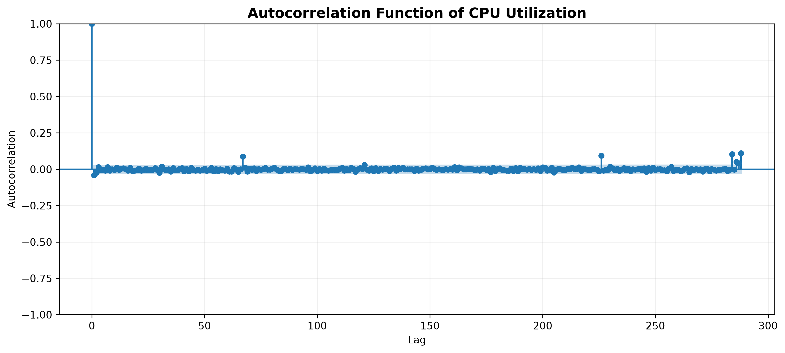

**Figure 4.** Autocorrelation function (ACF) of the EC2 CPU utilization time series. The plot shows the correlation between observations at different time lags and helps identify temporal dependence and possible periodic patterns.

## 3.6 Partial Autocorrelation Analysis

The Partial Autocorrelation Function (PACF) was also examined to identify potentially useful autoregressive relationships.

The PACF shows a relatively small contribution from the first lag, with most other lags remaining comparatively close to zero. A noticeable spike is also observed around approximately lag 67.

The limited number of strong PACF relationships suggests that the time series does not require a very high-order autoregressive model.

This supported the investigation of low-order ARIMA models during the forecasting stage.

---
#### Figure 5: Partial Autocorrelation Function

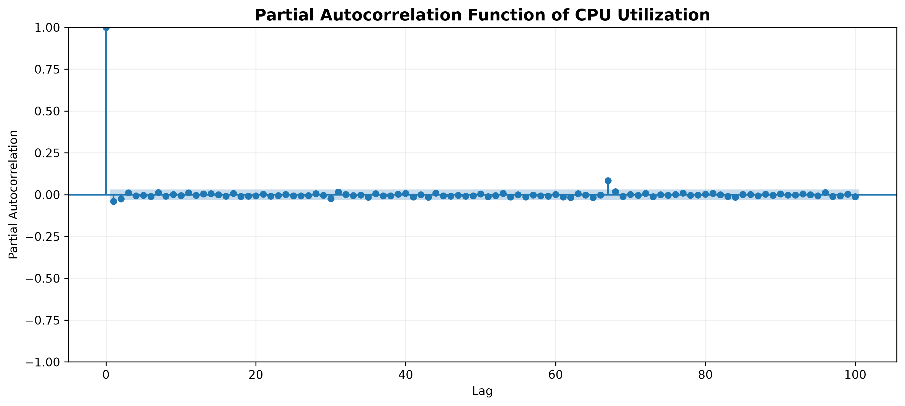

**Figure 5.** Partial autocorrelation function (PACF) of the EC2 CPU utilization time series. The PACF helps identify the direct contribution of individual lags after accounting for the effects of shorter lags and supports the selection of autoregressive model orders.

## 3.7 Stationarity Analysis

Stationarity is an important property in traditional time-series forecasting because many statistical forecasting models assume that the statistical characteristics of the series remain relatively stable over time.

The Augmented Dickey-Fuller (ADF) test was applied to the cleaned time series.

The results were:

| Measure | Result |
|---|---:|
| ADF statistic | -46.9228 |
| p-value | 0.0 |
| 1% critical value | -3.4320 |
| 5% critical value | -2.8623 |
| 10% critical value | -2.5672 |

The ADF statistic is substantially smaller than all three critical values, and the p-value is effectively zero.

The null hypothesis of the ADF test is that the time series contains a unit root and is non-stationary.

Since the p-value is effectively zero, the null hypothesis is rejected.

Therefore, the series can be treated as **stationary for the purposes of the initial ARIMA modelling**, and no first-order differencing was required.

Consequently, the ARIMA models were investigated with:

\[
d = 0
\]

---


## 3.8 Implications for Model Selection

The exploratory analysis provides several important observations that influenced the modelling strategy.

First, the series is highly right-skewed and contains extreme values. Therefore, anomaly detection methods should be capable of identifying observations far outside the normal range.

Second, the ACF and PACF analyses indicate some temporal dependence, but there is no strong and consistent daily seasonal pattern. This supports the investigation of low-order ARIMA models.

Third, the ADF test indicates that the series can be treated as stationary, allowing ARIMA models with no differencing to be investigated.

Finally, the presence of extreme observations suggests that forecasting errors may provide useful information for anomaly detection. If the forecasting model captures normal behavior but fails to predict an extreme observation, the resulting residual can become a strong anomaly signal.

These findings motivated the use of three complementary anomaly detection strategies:

1. **ARIMA residual-based detection**, based on deviations from forecasted values.
2. **Isolation Forest**, based on statistical and temporal features.
3. **LSTM Autoencoder**, based on reconstruction error from learned temporal patterns.

A hybrid approach was subsequently developed to investigate whether combining these complementary signals could improve anomaly-event detection.

---

## 3.9 Summary of Exploratory Analysis

The exploratory analysis established the following characteristics of the selected time series:

- The dataset contains 4,032 observations.
- Measurements are collected every 5 minutes.
- Most CPU-utilization values are concentrated in a relatively narrow range.
- The distribution is highly right-skewed.
- The series contains extreme observations.
- The skewness is approximately 13.99.
- The kurtosis is approximately 230.21.
- Rolling statistics reveal changes in local behavior and variability.
- ACF and PACF indicate limited but meaningful temporal dependence.
- No strong and consistent daily seasonal pattern was observed.
- The ADF test strongly supports stationarity.
- The results justify investigating low-order ARIMA models and complementary machine-learning and deep-learning anomaly detection methods.

The next stage of the project therefore focuses on **forecasting the expected time-series behavior and using deviations from that expected behavior as one of the anomaly detection signals**.

# 4. Time-Series Forecasting

## 4.1 Forecasting Objective

The first modelling stage of the project focuses on forecasting the expected behavior of the EC2 CPU-utilization time series.

Forecasting provides an estimate of what the system is expected to observe at a particular point in time. The difference between the actual observation and the forecast can then be used as an anomaly signal.

Two forecasting approaches were investigated:

1. Naive forecasting
2. ARIMA forecasting

The Naive model provides a simple baseline against which the more structured ARIMA model can be evaluated.

---

## 4.2 Chronological Data Split

A chronological train-validation-test strategy was used to avoid temporal data leakage.

The final split was:

| Dataset | Number of Observations |
|---|---:|
| Training | 2,419 |
| Validation | 806 |
| Final Test | 807 |

The training period extends from:

**14 February 2014 14:30**

to

**23 February 2014 00:00**

The validation period extends from:

**23 February 2014 00:05**

to

**25 February 2014 19:10**

The final test period begins at:

**25 February 2014 19:15**

and ends at:

**28 February 2014 14:25**

The final test set contains the officially annotated anomaly events used for the primary evaluation.

No future observations were used to train the forecasting models.

---

## 4.3 Naive Forecasting Baseline

A Naive forecasting model was used as the baseline forecasting method.

The Naive method predicts the next observation using the most recently observed value:

\[
\hat{y}_{t} = y_{t-1}
\]

where:

- \(y_t\) represents the actual observation at time \(t\),
- \(y_{t-1}\) represents the previous observation,
- \(\hat{y}_t\) represents the forecast.

Although simple, the Naive approach is an important baseline because any more advanced forecasting model should ideally demonstrate an improvement over this simple strategy.

The Naive model was evaluated using Mean Absolute Error (MAE) and Root Mean Squared Error (RMSE).

---

## 4.4 ARIMA Model

Autoregressive Integrated Moving Average (ARIMA) is a classical statistical approach for time-series forecasting.

An ARIMA model is represented as:

\[
ARIMA(p,d,q)
\]

where:

- \(p\) is the autoregressive order,
- \(d\) is the degree of differencing,
- \(q\) is the moving-average order.

Based on the exploratory analysis, the series was treated as stationary. Therefore, the initial value of the differencing parameter was:

\[
d = 0
\]

Several low-order ARIMA configurations were investigated.

The candidate models included:

| ARIMA Model | AIC | BIC |
|---|---:|---:|
| ARIMA(0,0,1) | -6652.871 | -6634.635 |
| ARIMA(1,0,0) | -6652.435 | -6634.198 |
| ARIMA(2,0,0) | -6652.402 | -6628.087 |
| ARIMA(0,0,2) | -6652.213 | -6627.898 |
| ARIMA(1,0,1) | -6651.772 | -6627.458 |
| ARIMA(1,0,2) | -6650.813 | -6620.419 |
| ARIMA(2,0,1) | -6650.808 | -6620.414 |
| ARIMA(0,0,0) | -6645.187 | -6633.029 |

The AIC and BIC values indicate that ARIMA(0,0,1) is the strongest model according to the information criteria, although the differences between several low-order models are very small.

Therefore, out-of-sample forecasting performance was also considered when selecting the final forecasting model.

---

## 4.5 Out-of-Sample Forecasting Results

The candidate models were evaluated on unseen chronological observations.

The results showed that ARIMA(1,0,0) provided the best overall out-of-sample forecasting performance among the investigated configurations.

The selected model was therefore:

\[
\boxed{ARIMA(1,0,0)}
\]

The final comparison between the Naive baseline and ARIMA(1,0,0) is shown below.

| Model | MAE | RMSE |
|---|---:|---:|
| Naive Forecast | 0.050979 | 0.175173 |
| ARIMA(1,0,0) | 0.031119 | 0.123077 |

ARIMA substantially improves forecasting accuracy compared with the Naive baseline.

The MAE improvement is approximately:

\[
\frac{0.050979-0.031119}{0.050979}\times100
\approx 39.0\%
\]

The RMSE improvement is approximately:

\[
\frac{0.175173-0.123077}{0.175173}\times100
\approx 29.8\%
\]

Therefore, ARIMA reduces the average absolute forecasting error by approximately **39%** compared with the Naive baseline and reduces RMSE by approximately **30%**.

---
#### Figure 6: Naive and ARIMA Forecast Comparison

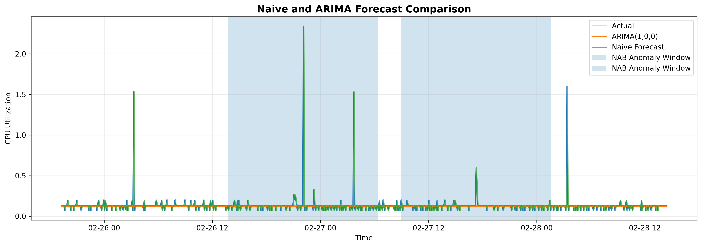

**Figure 6.** Comparison of the naive forecasting baseline and the selected ARIMA(1,0,0) model on the test period. ARIMA provides a substantially better overall forecast error than the naive baseline, although both approaches tend to underestimate the large anomalous spikes.

## 4.6 Forecasting Interpretation

The forecasting results demonstrate that incorporating temporal structure improves prediction compared with simply using the previous observation.

The Naive model provides a reasonable baseline because the time series contains short-term temporal dependence. However, ARIMA is able to model the temporal relationship more systematically and achieves lower forecasting error.

An important observation from the forecast visualization is that the ARIMA forecast remains relatively stable around the normal operating level and does not fully reproduce the largest spikes in CPU utilization.

Although this limits the ability of ARIMA to predict extreme events, it becomes useful for anomaly detection.

When an unusually large CPU-utilization observation occurs, the forecasting model may continue to predict a value close to the normal operating level. The resulting difference between the actual observation and the forecast becomes large.

This forecasting error can therefore be used as an anomaly score.

---

## 4.7 Forecasting Residuals

The forecasting residual is defined as:

\[
e_t = y_t - \hat{y}_t
\]

where:

- \(y_t\) is the actual observation,
- \(\hat{y}_t\) is the forecast,
- \(e_t\) is the forecasting residual.

For anomaly detection, the absolute residual is used:

\[
|e_t| = |y_t-\hat{y}_t|
\]

A large absolute residual indicates that the observed value differs substantially from what the forecasting model expected.

The ARIMA(1,0,0) model was therefore used not only for forecasting but also as the basis for a forecasting-based anomaly detection method.

---

## 4.8 Training-Based Anomaly Threshold

To prevent information leakage, the anomaly threshold was determined using the training residuals rather than the final test residuals.

The absolute training residual distribution was analyzed and the **99th percentile** was selected as the anomaly threshold.

The resulting frozen threshold was:

\[
\boxed{0.07615335}
\]

Therefore, an observation was classified as an ARIMA residual anomaly when:

\[
|e_t| \geq 0.07615335
\]

The threshold was fixed before evaluating the final test set.

This procedure ensures that the test observations do not influence the threshold selection.

---

## 4.9 ARIMA Residual-Based Anomaly Detection

The ARIMA residual-based detection process can be summarized as follows:

1. Train the ARIMA(1,0,0) model using training observations.
2. Generate forecasts.
3. Calculate the residual between actual and forecasted values.
4. Calculate the absolute residual.
5. Determine the 99th-percentile threshold from training residuals.
6. Freeze the threshold.
7. Apply the threshold to the final test observations.
8. Classify observations exceeding the threshold as anomalies.

The resulting anomaly score is:

\[
S_t = |y_t-\hat{y}_t|
\]

and the decision rule is:

\[
\text{Anomaly}_t =
\begin{cases}
1, & S_t \geq 0.07615335\\
0, & S_t < 0.07615335
\end{cases}
\]

---

## 4.10 ARIMA Anomaly Detection Results

The ARIMA residual-based detector identified **23 anomalous observations** in the 807-point final test set.

This corresponds to approximately:

\[
\frac{23}{807}\times100
\approx 2.85\%
\]

of the final test observations.

Using the exact point-level NAB labels, the detector achieved:

| Metric | Result |
|---|---:|
| Precision | 0.0870 |
| Recall | 1.0000 |
| F1-score | 0.1600 |
| ROC-AUC | 0.9981 |

The confusion matrix was:

| | Predicted Normal | Predicted Anomaly |
|---|---:|---:|
| Actual Normal | 784 | 21 |
| Actual Anomaly | 0 | 2 |

The detector therefore identified **both exact point-level anomalies**, resulting in a recall of 1.0.

The relatively low precision is caused by the fact that the detector identifies several observations that are not the two exact point labels but may still occur within the broader official anomaly periods.

---
#### Figure 7: ARIMA Residual-Based Anomaly Detection

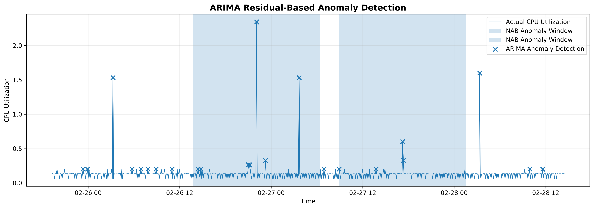

**Figure 7.** ARIMA residual-based anomaly detection on the final test period. Anomalies are identified when the absolute forecasting error exceeds the threshold estimated exclusively from the training residuals. The official NAB anomaly windows are shown for comparison.

## 4.11 Window-Level and Event-Level Evaluation

Point-level evaluation alone does not fully represent anomaly detection performance for time-series datasets because anomalies may persist over an extended period.

Therefore, the official NAB anomaly windows were also used for evaluation.

The final test period contains two major official anomaly windows.

The ARIMA residual detector produced:

- Window precision: **0.4783**
- Window recall: **0.0274**
- Window F1-score: **0.0518**
- Event detection rate: **100%**

Although only a small fraction of observations inside the official anomaly windows were individually flagged, the detector successfully produced at least one detection inside **both major anomaly events**.

Thus, the event-level detection rate is:

\[
\boxed{100\%}
\]

---

## 4.12 Forecasting Stage Summary

The forecasting experiments lead to several important conclusions.

First, ARIMA(1,0,0) significantly outperforms the Naive baseline in terms of both MAE and RMSE.

Second, the selected ARIMA model provides a useful representation of normal temporal behavior even though it does not reproduce the largest spikes.

Third, the inability of the forecasting model to predict extreme spikes becomes useful for anomaly detection because such deviations generate large residuals.

Finally, the ARIMA residual detector demonstrates very strong ranking ability, achieving a ROC-AUC of **0.9981** and detecting both major anomaly events.

However, its low point-level precision and sparse coverage of anomaly windows indicate that forecasting-based detection alone may not capture every aspect of complex temporal anomalies.

This motivates the use of complementary machine learning and deep learning approaches in the next stage of the project.
# 5. Machine Learning-Based Anomaly Detection

## 5.1 Motivation for Machine Learning

Although ARIMA residuals provide a useful forecasting-based anomaly signal, forecasting errors alone may not capture all forms of unusual behavior.

An observation can be considered anomalous because of several characteristics simultaneously, such as:

- its current value,
- its recent historical values,
- its daily historical value,
- its local mean,
- its local variability,
- and its temporal position.

To capture these multivariate relationships, an unsupervised machine learning approach was investigated.

The **Isolation Forest** algorithm was selected because it is specifically designed for anomaly detection and does not require a large set of labelled anomalies during training.

---

## 5.2 Isolation Forest

Isolation Forest is an unsupervised anomaly detection algorithm based on the principle that anomalous observations are easier to isolate than normal observations.

The algorithm constructs a collection of randomized decision trees. Observations that require shorter paths to become isolated are considered more anomalous.

The general intuition is:

> Normal observations tend to occur in dense regions and require more splits to isolate, whereas unusual observations can often be isolated with fewer splits.

This makes Isolation Forest suitable for the current problem because the training process does not require anomaly labels.

---

## 5.3 Feature Engineering

The raw CPU-utilization value was augmented with temporal and statistical features.

The first Isolation Forest implementation used the following features:

| Feature | Description |
|---|---|
| `value` | Current CPU utilization |
| `lag_1` | CPU utilization from the previous observation |
| `lag_12` | CPU utilization from one hour earlier |
| `lag_288` | CPU utilization from approximately 24 hours earlier |
| `rolling_mean_24h` | 24-hour rolling mean |
| `rolling_std_24h` | 24-hour rolling standard deviation |
| `deviation_from_mean` | Difference between current value and rolling mean |
| `hour` | Hour of the day |
| `day_of_week` | Day of the week |

Since the data are sampled every 5 minutes:

\[
12 \times 5 = 60\text{ minutes}
\]

Therefore, `lag_12` represents approximately one hour.

Similarly:

\[
288 \times 5 = 1440\text{ minutes}
=24\text{ hours}
\]

Therefore, `lag_288` represents the value approximately one day earlier.

The rolling mean and rolling standard deviation provide information about the local operating environment of the system.

---

## 5.4 Isolation Forest V1

The first Isolation Forest model was trained using the nine engineered features described above.

The feature engineering process resulted in **3,744 usable observations** after removing observations for which lag and rolling-window features could not be calculated.

The chronological split was maintained:

| Dataset | Observations |
|---|---:|
| Training | 2,131 |
| Validation | 806 |
| Final Test | 807 |

The Isolation Forest model used:

- 300 trees
- Automatic contamination setting
- Random state = 42

The anomaly score distribution on the training data was used to determine a frozen detection threshold.

The **99th percentile** of the training anomaly-score distribution was selected.

The resulting threshold was:

\[
\boxed{0.08853268}
\]

---

## 5.5 Isolation Forest V1 Results

Isolation Forest V1 identified **19 anomalous observations** in the final test set.

This represents approximately:

\[
\frac{19}{807}\times100
\approx 2.35\%
\]

of the final test observations.

The point-level results were:

| Metric | Result |
|---|---:|
| Precision | 0.0526 |
| Recall | 0.5000 |
| F1-score | 0.0952 |
| ROC-AUC | 0.9845 |

The confusion matrix was:

| | Predicted Normal | Predicted Anomaly |
|---|---:|---:|
| Actual Normal | 787 | 18 |
| Actual Anomaly | 1 | 1 |

The model successfully identified one of the two exact point-level anomaly labels.

At the broader event level, however, the model detected both major anomaly events.

The event-level detection rate was:

\[
\boxed{100\%}
\]

with detections occurring in both official anomaly windows.

---

## 5.6 Isolation Forest V2

A second version of the Isolation Forest model was developed to improve the representation of temporal information.

Instead of representing time only through integer-valued hour and day-of-week features, cyclical transformations were introduced.

The following additional features were used:

\[
hour\_sin =
\sin\left(\frac{2\pi \times hour}{24}\right)
\]

\[
hour\_cos =
\cos\left(\frac{2\pi \times hour}{24}\right)
\]

Similarly, day-of-week information was represented using:

\[
dow\_sin =
\sin\left(\frac{2\pi \times day\_of\_week}{7}\right)
\]

\[
dow\_cos =
\cos\left(\frac{2\pi \times day\_of\_week}{7}\right)
\]

This cyclical representation is useful because time is inherently periodic.

For example, hour 23 and hour 0 are close to each other in time, but their raw integer representations, 23 and 0, appear far apart. Sine and cosine transformations preserve this cyclic relationship.

---

## 5.7 Isolation Forest V2 Feature Set

The V2 model used 11 features:

| Feature Group | Features |
|---|---|
| Current value | `value` |
| Lag features | `lag_1`, `lag_12`, `lag_288` |
| Rolling statistics | `rolling_mean_24h`, `rolling_std_24h` |
| Local deviation | `deviation_from_mean` |
| Cyclical time | `hour_sin`, `hour_cos`, `dow_sin`, `dow_cos` |

After feature construction and removal of unavailable initial observations, the dataset contained **3,744 observations**.

The chronological split was:

| Dataset | Observations |
|---|---:|
| Training | 2,130 |
| Validation | 807 |
| Final Test | 807 |

The same general Isolation Forest configuration was used:

- 300 trees
- Automatic contamination
- Random state = 42

---

## 5.8 Isolation Forest V2 Threshold

The anomaly threshold was determined exclusively from the training anomaly-score distribution.

The 99th percentile was selected as the frozen threshold.

The resulting threshold was:

\[
\boxed{0.08179236}
\]

The threshold was then applied unchanged to the final test observations.

This preserves the leakage-safe experimental design used throughout the project.

---

## 5.9 Isolation Forest V2 Results

Isolation Forest V2 detected **36 anomalous observations** in the final test set.

This represents approximately:

\[
\frac{36}{807}\times100
\approx 4.46\%
\]

of the final test observations.

The point-level results were:

| Metric | Result |
|---|---:|
| Precision | 0.0556 |
| Recall | 1.0000 |
| F1-score | 0.1053 |
| ROC-AUC | 0.9795 |

The confusion matrix was:

| | Predicted Normal | Predicted Anomaly |
|---|---:|---:|
| Actual Normal | 771 | 34 |
| Actual Anomaly | 0 | 2 |

The model detected both exact point-level anomalies, resulting in a recall of **1.0000**.

The relatively low precision indicates that the model identifies a number of observations as unusual that do not correspond to the two exact point labels.

However, many of these detections fall within the broader official anomaly windows.

---
#### Figure 8: Isolation Forest V2 Anomaly Detection

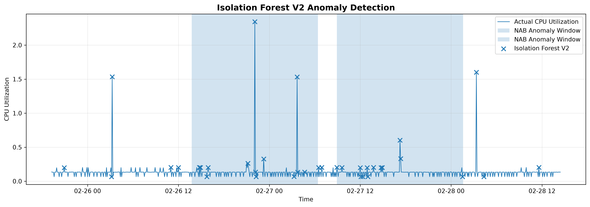

**Figure 8.** Isolation Forest V2 anomaly detection results on the final test period. The model uses temporal, lag-based, and rolling statistical features to identify observations that differ from the learned normal behavior. Official NAB anomaly windows are shown for comparison.

## 5.10 Window-Level Performance of Isolation Forest V2

When evaluated against the official anomaly windows, Isolation Forest V2 achieved:

| Metric | Result |
|---|---:|
| Window Precision | 0.7222 |
| Window Recall | 0.0647 |
| Window F1-score | 0.1187 |
| Event Detection Rate | 100% |

The model produced detections in both major anomaly events.

The event-level detection rate was therefore:

\[
\boxed{100\%}
\]

This demonstrates an important difference between point-level and event-level evaluation.

Although the model detects only a relatively small fraction of all observations contained in the official anomaly windows, it successfully identifies the existence of both anomalous events.

---

## 5.11 Comparison of Isolation Forest V1 and V2

The two Isolation Forest versions show different detection behavior.

| Metric | Isolation Forest V1 | Isolation Forest V2 |
|---|---:|---:|
| Number of test anomalies | 19 | 36 |
| Point Precision | 0.0526 | 0.0556 |
| Point Recall | 0.5000 | 1.0000 |
| Point F1 | 0.0952 | 0.1053 |
| Point ROC-AUC | 0.9845 | 0.9795 |
| Window Precision | 0.6842 | 0.7222 |
| Window Recall | 0.0323 | 0.0647 |
| Window F1 | 0.0618 | 0.1187 |
| Event Detection Rate | 100% | 100% |

Isolation Forest V2 detects more anomalous observations and substantially improves recall compared with V1.

The point-level recall increases from **0.5000 to 1.0000**, meaning that V2 identifies both exact point-level anomalies.

The window-level F1-score also increases from **0.0618 to 0.1187**.

Although the ROC-AUC decreases slightly from 0.9845 to 0.9795, the V2 model provides better threshold-based detection performance and better coverage of the official anomaly windows.

Therefore, Isolation Forest V2 was selected as the primary Isolation Forest model for subsequent model comparison and hybrid analysis.

---

## 5.12 Interpretation of Isolation Forest Results

The Isolation Forest experiments demonstrate that feature engineering can influence anomaly detection performance.

The addition of cyclical temporal features in V2 improves the model's ability to identify the anomalous events.

However, Isolation Forest remains an unsupervised outlier detector. It does not explicitly model the temporal sequence in the same way as ARIMA or an LSTM network.

Consequently, it may identify isolated observations that appear statistically unusual without necessarily understanding whether the observation belongs to a sustained temporal anomaly.

This limitation motivates the use of a deep learning approach capable of learning temporal patterns directly.

The next stage therefore investigates an **LSTM Autoencoder** for sequence-based anomaly detection.
# 6. Deep Learning-Based Anomaly Detection

## 6.1 Motivation for Deep Learning

The statistical ARIMA approach models temporal relationships using a relatively simple mathematical structure, while Isolation Forest identifies unusual observations using engineered features.

However, time-series anomalies can also be identified based on more complex temporal patterns. A deep learning model can potentially learn these patterns directly from sequences of observations.

For this reason, an **LSTM Autoencoder** was developed as the deep learning component of the project.

Long Short-Term Memory (LSTM) networks are a type of recurrent neural network designed to model sequential data. They are capable of learning dependencies across multiple time steps and are therefore suitable for time-series applications.

An autoencoder learns to reconstruct its input. When trained primarily on normal behavior, it can learn a representation of normal temporal patterns. Observations that differ substantially from these patterns can result in larger reconstruction errors and can therefore be considered anomalous.

---

## 6.2 LSTM Autoencoder Approach

The LSTM Autoencoder consists of two main components:

1. **Encoder**
2. **Decoder**

The encoder receives a sequence of observations and compresses it into a learned representation.

The decoder then attempts to reconstruct the original sequence from this representation.

The reconstruction error is used as the anomaly score.

For an input sequence \(X\) and reconstructed sequence \(\hat{X}\), the reconstruction error can be represented as:

\[
E(X,\hat{X}) =
\frac{1}{n}
\sum_{i=1}^{n}
(X_i-\hat{X}_i)^2
\]

A larger reconstruction error indicates that the sequence is more difficult for the model to reproduce and therefore provides stronger evidence of anomalous behavior.

---

## 6.3 Temporal Sequence Construction

The LSTM Autoencoder was designed to operate on sequences rather than individual observations.

A sequence length of **24 observations** was selected.

Because each observation represents 5 minutes:

\[
24 \times 5 = 120\text{ minutes}
\]

Therefore, each input sequence represents approximately **2 hours of temporal history**.

For each time step, a rolling sequence of 24 observations was constructed.

The complete sequence dataset contains:

\[
4009
\]

sequences.

Each sequence has the shape:

\[
(24,1)
\]

where:

- 24 represents the number of time steps,
- 1 represents the single CPU-utilization feature.

The resulting complete sequence array has the shape:

\[
(4009,24,1)
\]

---

## 6.4 Leakage-Safe Sequence Splitting

Because the project uses chronological time-series data, sequence splitting was performed based on the timestamp of the **last observation in each sequence**.

This is important because using future observations during training would result in temporal data leakage.

The resulting split was:

| Dataset | Sequences |
|---|---:|
| Training | 2,395 |
| Validation | 807 |
| Final Test | 807 |

The final test sequences begin at:

**25 February 2014 19:15**

which is consistent with the final test boundary used in the other experiments.

The training sequences end at:

**22 February 2014 23:55**

and the validation sequences end at:

**25 February 2014 19:10**.

This ensures that the model does not use future test observations during training.

---

## 6.5 Data Scaling

The CPU-utilization values were scaled using Min-Max normalization.

The scaling transformation is:

\[
x' =
\frac{x-x_{min}}
{x_{max}-x_{min}}
\]

The scaler was fitted **only on the training data**.

This is an important part of the leakage-prevention strategy.

The validation and test data were transformed using the scaler learned from the training observations rather than fitting separate scalers to future data.

The resulting scaled ranges were approximately:

| Dataset | Scaled Range |
|---|---|
| Training | 0.000 – 1.000 |
| Validation | 0.000 – 0.928 |
| Final Test | 0.000 – 1.485 |

The test range exceeding 1.0 is expected because some test observations are substantially larger than the maximum value observed during training.

---

## 6.6 LSTM Autoencoder Architecture

The LSTM Autoencoder consists of an encoder followed by a decoder.

The architecture used in the experiment was:

1. LSTM layer with 32 units
2. LSTM layer with 16 units
3. RepeatVector layer
4. LSTM layer with 16 units
5. LSTM layer with 32 units
6. TimeDistributed Dense layer with 1 output

The conceptual architecture is:

\[
Input
\rightarrow
LSTM(32)
\rightarrow
LSTM(16)
\rightarrow
Latent\ Representation
\rightarrow
RepeatVector
\rightarrow
LSTM(16)
\rightarrow
LSTM(32)
\rightarrow
Output
\]

The model contains approximately:

\[
15,905
\]

trainable parameters.

The architecture was intentionally kept relatively compact because the dataset contains only a few thousand observations.

---

## 6.7 Model Training

The LSTM Autoencoder was trained to minimize reconstruction loss.

Mean squared error was used as the reconstruction loss:

\[
MSE =
\frac{1}{n}
\sum_{i=1}^{n}
(x_i-\hat{x}_i)^2
\]

The training configuration included:

- Batch size: 32
- Maximum epochs: 50
- Early stopping: enabled
- Early stopping patience: 8
- Best model restoration: enabled
- Training shuffle: disabled

Training shuffle was disabled because the observations represent a chronological time series.

Early stopping was used to reduce the risk of unnecessary training once validation performance stopped improving.

---

## 6.8 Training Results

The model training stopped after **19 epochs** because of the early-stopping criterion.

The best validation loss was approximately:

\[
0.0016088
\]

The best validation performance occurred around the eleventh epoch, after which additional training did not provide a meaningful improvement.

This indicates that the model was able to learn the dominant temporal structure of the training data without requiring the full 50 training epochs.

---

## 6.9 Reconstruction Error

After training, reconstruction errors were calculated for the training, validation, and final test sequences.

The reconstruction-error distributions were:

| Dataset | Minimum | Maximum | Mean |
|---|---:|---:|---:|
| Training | 0.000084 | 0.030090 | 0.001515 |
| Validation | 0.000155 | 0.025571 | 0.001609 |
| Final Test | 0.000145 | 0.066664 | 0.003364 |

The mean reconstruction error on the final test set is higher than the training and validation means.

The maximum test reconstruction error is also substantially larger than the maximum training reconstruction error.

This indicates that some test sequences are considerably different from the patterns learned during training.

---

## 6.10 LSTM Anomaly Threshold

To maintain the leakage-safe experimental design, the anomaly threshold was determined using only the training reconstruction errors.

The **99th percentile** of the training reconstruction-error distribution was selected.

The resulting frozen threshold was:

\[
\boxed{0.02025180}
\]

An observation was therefore classified as anomalous when:

\[
Reconstruction\ Error
\geq
0.02025180
\]

The threshold was fixed before evaluating the final test set.

---

## 6.11 LSTM Autoencoder Test Results

The LSTM Autoencoder identified **35 anomalous observations** in the final test set.

This corresponds to approximately:

\[
\frac{35}{807}\times100
\approx 4.34\%
\]

of the final test observations.

The point-level results were:

| Metric | Result |
|---|---:|
| Precision | 0.0286 |
| Recall | 0.5000 |
| F1-score | 0.0541 |
| ROC-AUC | 0.9298 |

The confusion matrix was:

| | Predicted Normal | Predicted Anomaly |
|---|---:|---:|
| Actual Normal | 771 | 34 |
| Actual Anomaly | 1 | 1 |

The model therefore identified one of the two exact point-level anomaly labels.

The relatively low point-level precision indicates that many detected observations do not correspond to the two exact point labels.

However, point-level labels do not fully represent the duration of the anomalous events, so window-level evaluation is also important.

---
#### Figure 9: LSTM Autoencoder Anomaly Detection

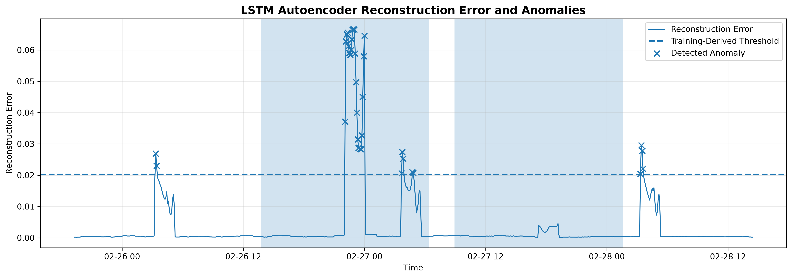

**Figure 9.** LSTM Autoencoder reconstruction error on the final test period. The dashed line represents the anomaly threshold derived from the training reconstruction errors. Large reconstruction errors indicate temporal patterns that differ substantially from those learned during training.

## 6.12 Window-Level Performance

Using the official NAB anomaly windows, the LSTM Autoencoder achieved:

| Metric | Result |
|---|---:|
| Window Precision | 0.8286 |
| Window Recall | 0.0721 |
| Window F1-score | 0.1327 |
| Event Detection Rate | 50% |

The window-level F1-score of **0.1327** is the highest among all evaluated models.

The high window precision indicates that a relatively large proportion of the observations flagged by the LSTM Autoencoder fall within the official anomaly windows.

However, the detector identified only one of the two major anomaly events.

Therefore, its event-level detection rate is:

\[
\boxed{50\%}
\]

This demonstrates that the LSTM Autoencoder provides precise anomaly detection for some anomalous behavior but is less sensitive to the second anomaly event.

---

## 6.13 Interpretation of LSTM Results

The LSTM Autoencoder demonstrates the value of modelling temporal sequences directly.

Unlike Isolation Forest, which operates on engineered feature vectors, the LSTM Autoencoder receives a sequence of 24 observations and learns a representation of temporal behavior.

Its highest window-level F1-score among the evaluated models indicates that its detections are relatively well aligned with the official anomaly windows.

However, the model does not detect both major events. This indicates that the temporal representation learned by the autoencoder is sensitive to certain anomalous patterns but may not capture every type of anomaly present in the dataset.

This result supports the idea that different anomaly detection models may capture different aspects of abnormal behavior.

---

## 6.14 Comparison of Detection Approaches

At this stage, three complementary anomaly detection strategies have been developed:

### ARIMA Residual Detection

Detects observations that deviate significantly from the expected forecast.

### Isolation Forest V2

Detects observations that are unusual in a multidimensional feature space containing temporal and statistical information.

### LSTM Autoencoder

Detects sequences that are difficult to reconstruct using a learned representation of normal temporal behavior.

The approaches therefore use fundamentally different sources of anomaly evidence.

| Approach | Main Anomaly Signal |
|---|---|
| ARIMA Residual | Forecasting error |
| Isolation Forest V2 | Multivariate outlier score |
| LSTM Autoencoder | Reconstruction error |

This complementarity motivates the next stage of the project, where anomaly evidence from multiple models is combined to construct hybrid detection approaches.
# 7. Hybrid Anomaly Detection

## 7.1 Motivation for a Hybrid Approach

The experimental results from the individual models show that different anomaly detection methods capture different aspects of abnormal behavior.

The ARIMA residual detector provides very strong point-level ranking performance and successfully detects both major anomaly events. Isolation Forest V2 provides stronger window-level performance than the ARIMA residual approach and also detects both major events. The LSTM Autoencoder achieves the highest window-level F1-score but detects only one of the two major events.

These observations suggest that the models are complementary rather than identical.

The three base models use different anomaly signals:

| Model | Anomaly Signal |
|---|---|
| ARIMA Residual | Deviation from forecast |
| Isolation Forest V2 | Multivariate statistical outlier score |
| LSTM Autoencoder | Temporal reconstruction error |

A hybrid approach was therefore investigated to determine whether combining these different signals could provide a more balanced anomaly detection system.

---

## 7.2 Hybrid Detection Concept

The basic idea behind the hybrid approach is to combine the anomaly evidence generated by the three base models.

Let:

\[
S_A
\]

represent the ARIMA anomaly score,

\[
S_I
\]

represent the Isolation Forest V2 anomaly score, and

\[
S_L
\]

represent the LSTM Autoencoder anomaly score.

A hybrid anomaly score can be represented generally as:

\[
S_H =
\frac{S_A' + S_I' + S_L'}{3}
\]

where:

\[
S_A', S_I', S_L'
\]

are normalized versions of the individual model scores.

Normalization is important because the three models produce scores on different numerical scales.

---

# 7.3 Hybrid V1 — Threshold-Normalized Score Combination

The first hybrid approach uses the frozen anomaly threshold of each individual model to normalize its score.

The normalized scores are calculated as:

\[
S_A' =
\frac{S_A}{T_A}
\]

\[
S_I' =
\frac{S_I}{T_I}
\]

\[
S_L' =
\frac{S_L}{T_L}
\]

where:

- \(T_A\) is the ARIMA threshold,
- \(T_I\) is the Isolation Forest V2 threshold,
- \(T_L\) is the LSTM Autoencoder threshold.

The thresholds are:

| Model | Frozen Threshold |
|---|---:|
| ARIMA | 0.07615335 |
| Isolation Forest V2 | 0.08179236 |
| LSTM Autoencoder | 0.02025180 |

For Hybrid V1, normalized scores were clipped to the range from 0 to 1 before averaging.

The hybrid score is therefore:

\[
S_{H1}
=
\frac{
clip(S_A/T_A)
+
clip(S_I/T_I)
+
clip(S_L/T_L)
}{3}
\]

The final Hybrid V1 threshold was determined from the training hybrid-score distribution using the 99th percentile.

The resulting threshold was:

\[
\boxed{0.67254367}
\]

---

## 7.4 Hybrid V1 Results

Hybrid V1 detected **33 anomalous observations** in the final test set.

This represents approximately:

\[
\frac{33}{807}\times100
\approx 4.09\%
\]

of the final test observations.

The point-level results were:

| Metric | Result |
|---|---:|
| Precision | 0.0606 |
| Recall | 1.0000 |
| F1-score | 0.1143 |
| ROC-AUC | 0.9904 |

The model detected both exact point-level anomalies.

At the window level:

| Metric | Result |
|---|---:|
| Window Precision | 0.6667 |
| Window Recall | 0.0547 |
| Window F1-score | 0.1011 |
| Event Detection Rate | 100% |

Hybrid V1 successfully detected both major anomaly events.

The event-level detection rate was therefore:

\[
\boxed{100\%}
\]

---

# 7.5 Limitations of Hybrid V1

Although Hybrid V1 successfully combines the three anomaly signals, threshold-based normalization has an important limitation.

When a score is divided by its threshold and then clipped to 1, all values above the threshold become equivalent:

\[
S' = 1
\]

For example, scores corresponding to:

\[
1.1T,\quad 2T,\quad 5T
\]

would all become:

\[
1
\]

after clipping.

This means that the magnitude of extreme anomaly evidence is lost.

Therefore, a more information-preserving normalization method was investigated.

---

# 7.6 Hybrid V2 — Percentile-Based Score Combination

Hybrid V2 uses empirical percentile normalization instead of threshold-based clipping.

For each base model, the training score distribution is used as the reference distribution.

For a test score \(s\), its percentile represents the proportion of training scores that are less than or equal to that value.

Conceptually:

\[
S' =
Percentile(s)
\]

This transformation maps the scores approximately to the range:

\[
0 \leq S' \leq 1
\]

while preserving the relative extremeness of observations.

Unlike clipping, percentile normalization does not make every value above the anomaly threshold identical.

For example, an observation at the 99.5th percentile remains distinguishable from one at the 99.99th percentile.

---

## 7.7 Hybrid V2 Score

The percentile-normalized scores from the three base models are averaged:

\[
S_{H2}
=
\frac{
P_A + P_I + P_L
}{3}
\]

where:

- \(P_A\) is the ARIMA percentile score,
- \(P_I\) is the Isolation Forest V2 percentile score,
- \(P_L\) is the LSTM Autoencoder percentile score.

The hybrid score is therefore based on the relative extremeness of an observation according to each model.

The training Hybrid V2 score distribution had the following characteristics:

| Statistic | Value |
|---|---:|
| Number of observations | 2,130 |
| Mean | 0.5002 |
| Standard deviation | 0.1804 |
| Minimum | 0.0888 |
| 25th percentile | 0.3662 |
| Median | 0.4836 |
| 75th percentile | 0.6203 |
| Maximum | 0.9909 |

The 99th percentile of the training Hybrid V2 score was selected as the final detection threshold.

The resulting threshold was:

\[
\boxed{0.93215728}
\]

---

# 7.8 Hybrid V2 Results

Hybrid V2 detected **40 anomalous observations** in the final test set.

This represents approximately:

\[
\frac{40}{807}\times100
\approx 4.96\%
\]

of the final test observations.

The point-level results were:

| Metric | Result |
|---|---:|
| Precision | 0.0500 |
| Recall | 1.0000 |
| F1-score | 0.0952 |
| ROC-AUC | 0.9950 |

The confusion matrix was:

| | Predicted Normal | Predicted Anomaly |
|---|---:|---:|
| Actual Normal | 767 | 38 |
| Actual Anomaly | 0 | 2 |

Hybrid V2 therefore detected both exact point-level anomalies.

---
#### Figure 10: Hybrid V2 Anomaly Detection

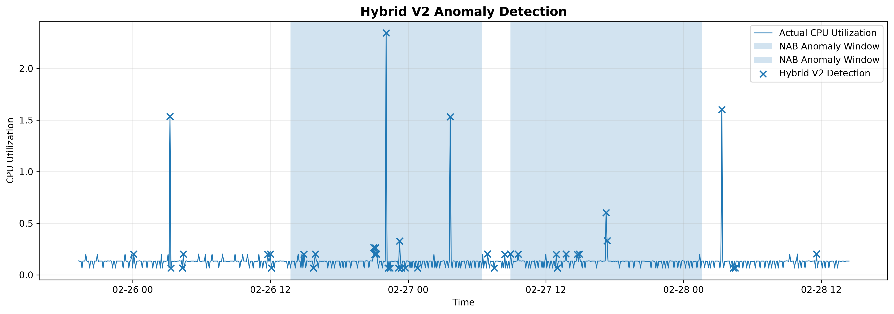

**Figure 10.** Hybrid V2 anomaly detection results on the final test period. The method combines normalized anomaly evidence from ARIMA residuals, Isolation Forest V2, and the LSTM Autoencoder to provide a complementary ensemble-based detection signal.

## 7.9 Hybrid V2 Window-Level Results

At the anomaly-window level, Hybrid V2 achieved:

| Metric | Result |
|---|---:|
| Window Precision | 0.6250 |
| Window Recall | 0.0622 |
| Window F1-score | 0.1131 |
| Event Detection Rate | 100% |

The model produced detections in both official anomaly windows.

Therefore, its event-level detection rate was:

\[
\boxed{100\%}
\]

Hybrid V2 also achieved a point-level ROC-AUC of **0.9950**, indicating strong ranking ability despite its relatively low precision at the selected threshold.

---

# 7.10 Comparison of Hybrid V1 and Hybrid V2

The two hybrid approaches demonstrate different trade-offs.

| Metric | Hybrid V1 | Hybrid V2 |
|---|---:|---:|
| Test anomalies | 33 | 40 |
| Point Precision | 0.0606 | 0.0500 |
| Point Recall | 1.0000 | 1.0000 |
| Point F1 | 0.1143 | 0.0952 |
| Point ROC-AUC | 0.9904 | 0.9950 |
| Window Precision | 0.6667 | 0.6250 |
| Window Recall | 0.0547 | 0.0622 |
| Window F1 | 0.1011 | 0.1131 |
| Event Detection Rate | 100% | 100% |

Hybrid V1 provides higher point-level F1-score and precision.

Hybrid V2 provides higher ROC-AUC and slightly higher window-level F1-score.

Therefore, neither hybrid version dominates the other across all metrics.

Hybrid V2 is particularly useful when preserving the relative extremeness of anomaly scores is important, while Hybrid V1 provides a simpler threshold-relative interpretation.

---

# 7.11 Why the Hybrid Approach Does Not Automatically Become the Best Model

An important finding from the experiments is that combining multiple models does not necessarily guarantee better performance on every metric.

The individual models have different strengths.

ARIMA provides excellent point-level ranking performance.

Isolation Forest V2 provides strong window-level performance while detecting both major events.

The LSTM Autoencoder provides the highest window-level F1-score.

The hybrid models combine these signals and successfully detect both major events, but their simple averaging strategy does not outperform the strongest individual model on every evaluation criterion.

This is an important experimental result because it demonstrates that model combination should be evaluated empirically rather than assuming that an ensemble will always improve performance.

---

# 7.12 Hybrid Model Interpretation

The hybrid approach provides a broader representation of anomaly evidence.

An observation may receive a high hybrid score because:

- it has a large deviation from the ARIMA forecast,
- it appears statistically unusual according to Isolation Forest,
- it is difficult for the LSTM Autoencoder to reconstruct,
- or multiple models provide moderately strong anomaly evidence simultaneously.

Therefore, the hybrid score can be interpreted as a measure of **combined anomaly evidence**, rather than as a probability of being anomalous.

This distinction is important because the scores have not been calibrated as probabilities.

---

# 7.13 Summary of the Hybrid Experiment

The hybrid experiments demonstrate that combining heterogeneous anomaly detection signals can provide useful complementary information.

Both Hybrid V1 and Hybrid V2 successfully detected the two major anomaly events.

Hybrid V1 achieved:

- Point F1 = **0.1143**
- Point ROC-AUC = **0.9904**
- Window F1 = **0.1011**
- Event Detection Rate = **100%**

Hybrid V2 achieved:

- Point F1 = **0.0952**
- Point ROC-AUC = **0.9950**
- Window F1 = **0.1131**
- Event Detection Rate = **100%**

The results indicate that the hybrid framework is useful for combining different forms of anomaly evidence, but further improvements would require more sophisticated fusion strategies, such as optimized model weights, temporal ensemble rules, or supervised calibration when sufficient labelled data are available.

The next section presents the overall experimental comparison of all models using point-level, window-level, and event-level evaluation.
# 8. Experimental Setup and Evaluation Metrics

## 8.1 Experimental Design

The experiments were designed to compare statistical, machine learning, deep learning, and hybrid approaches for time-series anomaly detection.

A chronological evaluation strategy was used throughout the project. This was necessary because time-series observations have a natural temporal order and random data splitting can result in information from the future being introduced into the training process.

The experimental pipeline consists of the following stages:

1. Data collection and loading
2. Data cleaning and preprocessing
3. Exploratory time-series analysis
4. Chronological train-validation-test splitting
5. Forecasting using Naive and ARIMA models
6. ARIMA residual-based anomaly detection
7. Feature engineering for Isolation Forest
8. Isolation Forest anomaly detection
9. Temporal sequence construction for LSTM Autoencoder
10. LSTM Autoencoder anomaly detection
11. Hybrid anomaly-score combination
12. Point-level evaluation
13. Window-level evaluation
14. Event-level evaluation
15. Model agreement analysis
16. Interactive visualization using Streamlit

---

## 8.2 Leakage Prevention

Preventing data leakage was an important part of the experimental design.

Data leakage occurs when information from future or test observations is unintentionally used during model training, feature construction, normalization, or threshold selection.

The following measures were implemented:

### Chronological Data Splitting

The data were divided into training, validation, and final test periods in chronological order.

No random shuffling was used for the main time-series split.

### Training-Based Thresholds

Anomaly detection thresholds were calculated using training distributions.

For example, the ARIMA threshold was calculated from training absolute residuals rather than test residuals.

Similarly, Isolation Forest and LSTM thresholds were determined from their respective training score distributions.

### Training-Only Scaling

For the LSTM Autoencoder, the Min-Max scaler was fitted only on training observations.

Validation and test observations were transformed using the training-fitted scaler.

### Chronological Sequence Splitting

LSTM sequences were assigned to training, validation, and test sets based on the timestamp of the final observation in each sequence.

These measures ensure that the final test set remains an unseen evaluation set.

---

# 8.3 Models Evaluated

Six model configurations were included in the final comparative analysis:

| Model | Category | Main Signal |
|---|---|---|
| ARIMA Residual | Statistical | Forecasting residual |
| Isolation Forest V1 | Machine Learning | Multivariate outlier score |
| Isolation Forest V2 | Machine Learning | Temporal/statistical outlier score |
| LSTM Autoencoder | Deep Learning | Reconstruction error |
| Hybrid V1 | Hybrid | Threshold-normalized combined score |
| Hybrid V2 | Hybrid | Percentile-normalized combined score |

The Naive forecasting method was used as a forecasting baseline but was not treated as an anomaly detection model.

---

# 8.4 Point-Level Evaluation

Point-level evaluation considers each individual observation as either normal or anomalous.

For binary anomaly classification, four quantities are important:

- True Positive (TP)
- True Negative (TN)
- False Positive (FP)
- False Negative (FN)

### True Positive

A true positive occurs when an actual anomalous observation is correctly identified as anomalous.

### True Negative

A true negative occurs when a normal observation is correctly identified as normal.

### False Positive

A false positive occurs when a normal observation is incorrectly classified as anomalous.

### False Negative

A false negative occurs when an actual anomaly is not detected.

---

## 8.5 Precision

Precision measures how many observations classified as anomalies are actually anomalous.

\[
Precision =
\frac{TP}{TP+FP}
\]

A high precision means that the model generates relatively few false alarms.

---

## 8.6 Recall

Recall measures how many of the actual anomalies are successfully detected.

\[
Recall =
\frac{TP}{TP+FN}
\]

A high recall is particularly important in anomaly detection because missing a genuine anomaly may be more costly than generating an additional false alarm.

---

## 8.7 F1-Score

The F1-score provides a balance between precision and recall.

\[
F1 =
2
\frac{Precision \times Recall}
{Precision + Recall}
\]

The F1-score is useful when both missed anomalies and false alarms need to be considered.

---

# 8.8 ROC-AUC

Receiver Operating Characteristic Area Under the Curve (ROC-AUC) evaluates the ranking quality of an anomaly score across different thresholds.

A ROC-AUC value close to:

\[
1.0
\]

indicates strong separation between normal and anomalous observations.

Unlike a single threshold-based F1-score, ROC-AUC considers the ranking behavior across a range of possible thresholds.

This is particularly useful in this project because several anomaly detection models produce continuous anomaly scores.

---

# 8.9 Window-Level Evaluation

Point-level evaluation can be insufficient for time-series anomaly detection.

In real monitoring systems, an anomaly may continue for an extended period rather than occurring at only one timestamp.

The NAB dataset therefore provides anomaly windows representing periods associated with anomalous behavior.

For this project, the official NAB anomaly windows were used for an additional evaluation.

The final test set contains:

\[
402
\]

observations inside the official anomaly windows and:

\[
405
\]

observations outside the anomaly windows.

Therefore:

\[
402 + 405 = 807
\]

total final test observations.

---

## 8.10 Window Precision

Window-level precision measures how effectively the detected observations correspond to the official anomaly-window structure.

A detection is considered relevant when it occurs within an official anomaly window.

This evaluation provides a broader perspective than exact point labels because it recognizes that an anomaly can represent an extended abnormal period.

---

## 8.11 Window Recall

Window-level recall measures the proportion of anomalous-window observations that are detected.

This metric can remain low even when the model successfully detects the existence of an anomaly event because a detector may flag only a few representative observations inside a long anomaly window.

This behavior is observed in several models in this project.

Therefore, window recall should not be interpreted independently from event-level detection.

---

# 8.12 Event-Level Evaluation

Event-level evaluation answers a different question:

> **Did the model detect the anomaly event at least once?**

For each official NAB anomaly window, the model is considered to have detected the event if at least one predicted anomaly occurs within that window.

There are two major anomaly windows in the final test period.

The event detection rate is calculated as:

\[
Event\ Detection\ Rate =
\frac{\text{Number of detected anomaly events}}
{\text{Total anomaly events}}
\]

For example, detecting both of the two official anomaly events gives:

\[
\frac{2}{2}=100\%
\]

This metric is especially useful for monitoring applications where detecting that an abnormal event has occurred may be more important than identifying every anomalous timestamp within the event.

---

# 8.13 Why Multiple Evaluation Levels Are Necessary

The project uses point-level, window-level, and event-level evaluation because each captures a different aspect of anomaly detection performance.

### Point-Level

Answers:

> Did the model identify the exact anomalous observation?

### Window-Level

Answers:

> How well do the detections align with the broader anomalous period?

### Event-Level

Answers:

> Did the model successfully detect the existence of the anomaly event?

A model can therefore perform well at one level and poorly at another.

For example, a model may detect only a few observations within an anomaly window but still successfully identify both anomaly events.

This is why relying on a single evaluation metric would provide an incomplete assessment.

---

# 8.14 Experimental Threshold Strategy

A common threshold of 99th percentile was used for the major individual anomaly detection models.

The thresholds were calculated independently from training score distributions.

The final frozen thresholds were:

| Model | Threshold |
|---|---:|
| ARIMA Residual | 0.07615335 |
| Isolation Forest V2 | 0.08179236 |
| LSTM Autoencoder | 0.02025180 |
| Hybrid V1 | 0.67254367 |
| Hybrid V2 | 0.93215728 |

The thresholds were not optimized using the final test labels.

This is important because directly optimizing a threshold using the final test set would result in test-set information influencing the model evaluation.

---

# 8.15 Software and Tools

The project was implemented using Python and several commonly used data science and machine learning libraries.

The main tools and libraries include:

| Tool / Library | Purpose |
|---|---|
| Python | Main programming language |
| Pandas | Data loading and manipulation |
| NumPy | Numerical computation |
| Matplotlib | Data visualization |
| Seaborn | Exploratory visualization |
| Statsmodels | ARIMA and statistical analysis |
| Scikit-learn | Isolation Forest and evaluation |
| TensorFlow / Keras | LSTM Autoencoder |
| SciPy | Percentile-based score normalization |
| Jupyter Notebook | Experimental development |
| Streamlit | Interactive dashboard |
| VS Code | Development environment |

---

# 8.16 Computational Workflow

The complete experimental workflow can be summarized as:

```text
Raw NAB Time Series
        ↓
Data Cleaning
        ↓
Exploratory Analysis
        ↓
Chronological Train / Validation / Test Split
        ↓
        ├── Naive Forecast
        │
        ├── ARIMA Forecast
        │       ↓
        │   Residual Anomaly Detection
        │
        ├── Feature Engineering
        │       ↓
        │   Isolation Forest V1
        │       ↓
        │   Isolation Forest V2
        │
        └── Sequence Construction
                ↓
          LSTM Autoencoder
                ↓
        Reconstruction Error
                ↓
      ┌─────────────────────┐
      │ Hybrid V1 / V2      │
      └─────────────────────┘
                ↓
       Model Comparison
                ↓
 Point / Window / Event Evaluation
                ↓
 Model Agreement & Explainability
                ↓
      Streamlit Dashboard
# 9. Final Results and Detailed Model Comparison

## 9.1 Overview

The final experiments compared statistical, machine learning, deep learning, and hybrid anomaly detection approaches on the unseen final test period.

The comparison was performed using point-level precision, recall, F1-score, ROC-AUC, window-level precision, window-level recall, window-level F1-score, and event detection rate.

The results demonstrate that different models have different strengths. No single approach achieved the best performance across every evaluation criterion.

---

## 9.2 Final Model Comparison

The complete comparison is shown below.

| Model | Point Precision | Point Recall | Point F1 | Point ROC-AUC | Window Precision | Window Recall | Window F1 | Event Detection |
|---|---:|---:|---:|---:|---:|---:|---:|---:|
| ARIMA Residual | 0.0870 | 1.0000 | 0.1600 | 0.9981 | 0.4783 | 0.0274 | 0.0518 | 100% |
| Isolation Forest V1 | 0.0526 | 0.5000 | 0.0952 | 0.9845 | 0.6842 | 0.0323 | 0.0618 | 100% |
| Isolation Forest V2 | 0.0556 | 1.0000 | 0.1053 | 0.9795 | 0.7222 | 0.0647 | 0.1187 | 100% |
| LSTM Autoencoder | 0.0286 | 0.5000 | 0.0541 | 0.9298 | 0.8286 | 0.0721 | 0.1327 | 50% |
| Hybrid V1 | 0.0606 | 1.0000 | 0.1143 | 0.9904 | 0.6667 | 0.0547 | 0.1011 | 100% |
| Hybrid V2 | 0.0500 | 1.0000 | 0.0952 | 0.9950 | 0.6250 | 0.0622 | 0.1131 | 100% |

---
#### Figure 11: Model Performance Comparison

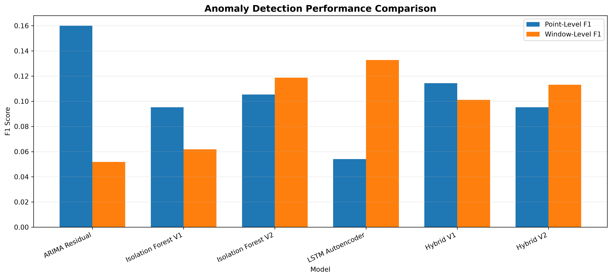

**Figure 11.** Comparison of point-level and window-level F1 scores across the evaluated anomaly detection approaches. The results demonstrate that model performance depends on the evaluation perspective: ARIMA Residual achieves the highest point-level F1, while the LSTM Autoencoder achieves the highest window-level F1.
## 9.3 ARIMA Residual-Based Detection

ARIMA Residual was the strongest model according to the exact point-level F1-score and ROC-AUC.

Its point-level results were:

- Precision: 0.0870
- Recall: 1.0000
- F1-score: 0.1600
- ROC-AUC: 0.9981

The model detected both anomaly events, resulting in an event detection rate of 100%.

The high ROC-AUC indicates that the ARIMA residual score provides strong ranking of anomalous observations relative to normal observations.

However, the point-level precision was low.

This occurred because the model produced several false positive detections while attempting to capture all anomalous points.

The window-level recall was also low at 0.0274.

This is mainly because the official NAB anomaly windows are much longer than the number of points actually flagged by the residual detector.

Therefore, ARIMA is particularly effective at identifying strong deviations from expected behavior, but it does not continuously mark the complete duration of an anomaly event.

---

## 9.4 Isolation Forest V1

Isolation Forest V1 achieved:

- Point precision: 0.0526
- Point recall: 0.5000
- Point F1-score: 0.0952
- ROC-AUC: 0.9845

At the window level, it achieved:

- Precision: 0.6842
- Recall: 0.0323
- F1-score: 0.0618

The model successfully detected both anomaly events.

Isolation Forest V1 used raw temporal features together with lagged values and rolling statistics.

Although the model was capable of detecting unusual observations, its point-level recall was only 50%.

This indicates that some of the exact anomaly labels were not sufficiently separated from normal observations by the V1 feature representation.

---

## 9.5 Isolation Forest V2

Isolation Forest V2 introduced improved temporal feature representation.

In addition to the original features, cyclical representations of hour-of-day and day-of-week were included:

\[
hour\_sin,\ hour\_cos,\ day\_sin,\ day\_cos
\]

The resulting model achieved:

- Point precision: 0.0556
- Point recall: 1.0000
- Point F1-score: 0.1053
- ROC-AUC: 0.9795

At the window level:

- Precision: 0.7222
- Recall: 0.0647
- F1-score: 0.1187

The model detected both anomaly events.

Compared with V1, V2 increased point recall from 0.50 to 1.00.

It also increased window F1-score from 0.0618 to 0.1187.

However, the number of false positive detections also increased.

This demonstrates the trade-off between sensitivity and false-alarm rate.

Overall, Isolation Forest V2 provided a better window-level balance than V1.

---

## 9.6 LSTM Autoencoder

The LSTM Autoencoder achieved:

- Point precision: 0.0286
- Point recall: 0.5000
- Point F1-score: 0.0541
- ROC-AUC: 0.9298

However, it achieved the highest window-level performance among the evaluated models:

- Window precision: 0.8286
- Window recall: 0.0721
- Window F1-score: 0.1327

The model detected one of the two official anomaly events, resulting in an event detection rate of 50%.

The high window precision indicates that when the LSTM Autoencoder generated anomaly detections, they were strongly concentrated inside the official anomaly windows.

However, it failed to detect the second anomaly event.

This demonstrates an important characteristic of deep learning-based anomaly detection: a model can produce highly relevant detections while still being sensitive to the type of temporal pattern observed in the data.

The LSTM Autoencoder therefore provided the best window-level F1-score but was not the most reliable model for detecting all anomaly events.

---

## 9.7 Hybrid V1

Hybrid V1 combined normalized anomaly evidence from:

1. ARIMA residual error
2. Isolation Forest V2 anomaly score
3. LSTM Autoencoder reconstruction error

Each component score was normalized relative to its training-derived threshold and then combined.

The final results were:

- Point precision: 0.0606
- Point recall: 1.0000
- Point F1-score: 0.1143
- ROC-AUC: 0.9904
- Window precision: 0.6667
- Window recall: 0.0547
- Window F1-score: 0.1011
- Event detection: 100%

Hybrid V1 successfully detected both anomaly events.

The model provided a balanced representation of evidence from statistical, machine learning, and deep learning methods.

However, its window-level F1-score was lower than both Isolation Forest V2 and the LSTM Autoencoder.

Therefore, combining models did not automatically improve every evaluation metric.

---

## 9.8 Hybrid V2

Hybrid V2 was developed to improve the score combination strategy.

Instead of simply normalizing scores using fixed threshold ratios, the component anomaly scores were converted into percentile-based scores.

This approach preserves the relative extremeness of observations and reduces the influence of differences in the numerical scales of the individual anomaly scores.

The final Hybrid V2 results were:

- Point precision: 0.0500
- Point recall: 1.0000
- Point F1-score: 0.0952
- ROC-AUC: 0.9950
- Window precision: 0.6250
- Window recall: 0.0622
- Window F1-score: 0.1131
- Event detection: 100%

Hybrid V2 successfully detected both anomaly events.

Its ROC-AUC of 0.9950 was the second-highest among the evaluated models, after ARIMA Residual.

The model also achieved higher window-level F1-score than ARIMA Residual and Isolation Forest V1.

However, it did not outperform Isolation Forest V2 or the LSTM Autoencoder in window-level F1-score.

---

# 9.9 Best Model by Evaluation Criterion

Different models achieved the best results for different criteria.

### Best Point-Level F1

ARIMA Residual achieved the highest point-level F1-score:

\[
F1 = 0.1600
\]

This indicates the strongest balance between exact anomaly precision and recall.

### Best Point-Level ROC-AUC

ARIMA Residual also achieved the highest ROC-AUC:

\[
ROC-AUC = 0.9981
\]

This indicates excellent ranking capability between anomalous and normal observations.

### Best Window-Level Precision

LSTM Autoencoder achieved the highest window precision:

\[
Precision = 0.8286
\]

This means its detections were highly concentrated within the official anomaly windows.

### Best Window-Level F1

LSTM Autoencoder achieved the highest window F1-score:

\[
F1 = 0.1327
\]

However, it detected only one of the two anomaly events.

### Best Event Detection Reliability

ARIMA Residual, Isolation Forest V1, Isolation Forest V2, Hybrid V1, and Hybrid V2 all detected both official anomaly events.

Therefore, five of the six evaluated detection approaches achieved:

\[
Event\ Detection = 100\%
\]

---

# 9.10 Comparison of Isolation Forest Versions

The comparison between the two Isolation Forest versions demonstrates the effect of feature engineering.

| Metric | V1 | V2 |
|---|---:|---:|
| Point Precision | 0.0526 | 0.0556 |
| Point Recall | 0.5000 | 1.0000 |
| Point F1 | 0.0952 | 0.1053 |
| ROC-AUC | 0.9845 | 0.9795 |
| Window Precision | 0.6842 | 0.7222 |
| Window Recall | 0.0323 | 0.0647 |
| Window F1 | 0.0618 | 0.1187 |
| Event Detection | 100% | 100% |

V2 improved recall and window-level performance substantially.

The decrease in ROC-AUC from 0.9845 to 0.9795 shows that feature engineering does not necessarily improve every metric.

Nevertheless, V2 was preferred over V1 because it provided stronger anomaly-event coverage and better window-level F1.

---

# 9.11 Comparison of Hybrid Versions

Hybrid V1 and Hybrid V2 used different score normalization strategies.

| Metric | Hybrid V1 | Hybrid V2 |
|---|---:|---:|
| Point Precision | 0.0606 | 0.0500 |
| Point Recall | 1.0000 | 1.0000 |
| Point F1 | 0.1143 | 0.0952 |
| ROC-AUC | 0.9904 | 0.9950 |
| Window Precision | 0.6667 | 0.6250 |
| Window Recall | 0.0547 | 0.0622 |
| Window F1 | 0.1011 | 0.1131 |
| Event Detection | 100% | 100% |

Hybrid V1 produced better point-level F1 and precision.

Hybrid V2 produced better ROC-AUC, window recall, and window F1.

This indicates that percentile normalization changed the ranking and distribution of the combined anomaly evidence.

Neither hybrid version was universally superior.

---

# 9.12 Why the Best Model Depends on the Objective

The experimental results demonstrate that anomaly detection should not be evaluated using a single metric.

If the main objective is:

> **Identify exact anomalous observations with strong ranking quality**

then ARIMA Residual is the strongest choice.

If the objective is:

> **Generate highly concentrated detections within anomalous periods**

then the LSTM Autoencoder provides the highest window precision and window F1.

If the objective is:

> **Detect both anomaly events reliably while using multivariate temporal features**

then Isolation Forest V2 is an attractive choice.

If the objective is:

> **Combine evidence from multiple fundamentally different detection approaches**

then Hybrid V1 or Hybrid V2 provides an ensemble-based solution with 100% event detection.

---

# 9.13 Important Interpretation of Low Precision

The point-level precision values are relatively low across the models.

This should be interpreted in the context of the dataset.

The final test set contains only two exact point labels:

- 2014-02-26 22:05:00
- 2014-02-27 17:15:00

while the official anomaly windows cover much larger periods.

Therefore, a model can correctly identify the anomalous event while flagging observations around the event that are not included in the exact point labels.

Such detections may appear as false positives under point-level evaluation even though they occur inside or near the broader anomalous behavior.

This difference between exact labels and anomaly windows is an important reason for reporting multiple evaluation perspectives.

---

# 9.14 Overall Findings

The main findings from the experiments are:

1. ARIMA provided substantially better forecasting performance than the Naive baseline.

2. Forecasting residuals can be highly effective for detecting abrupt deviations from expected behavior.

3. Isolation Forest benefited from temporal and cyclical feature engineering.

4. Isolation Forest V2 improved anomaly-event coverage and window-level F1 compared with V1.

5. The LSTM Autoencoder achieved the highest window-level F1-score but missed one of the two anomaly events.

6. Hybrid approaches successfully combined information from multiple detection methods.

7. Hybrid V2 achieved very strong ROC-AUC while maintaining 100% event detection.

8. No single model was best across all evaluation metrics.

9. Event-level evaluation provided an important complementary view of anomaly detection performance.

10. The results demonstrate the value of comparing multiple approaches rather than assuming that a more complex model will always outperform a simpler statistical model.

---

# 9.15 Final Model Selection

Based on the experimental results, the project does not select one universally best model.

Instead, model selection depends on the intended application.

For exact point-level anomaly ranking, **ARIMA Residual** is the strongest model.

For window-level detection quality, **LSTM Autoencoder** performs best.

For reliable detection of both anomaly events with temporal feature engineering, **Isolation Forest V2** provides a strong balance.

For ensemble-based detection, **Hybrid V2** provides strong ranking performance and detects both anomaly events.

Therefore, the final system presents all major approaches rather than replacing them with a single model.

This multi-model perspective is one of the main contributions of the project.

---

# 9.16 Conclusion of Experimental Results

The experiments demonstrate that statistical forecasting, machine learning, and deep learning approaches capture different aspects of anomalous time-series behavior.

ARIMA is effective at identifying deviations from expected forecasts.

Isolation Forest captures unusual combinations of temporal and statistical features.

The LSTM Autoencoder captures deviations from learned temporal representations.

The hybrid approaches combine these different sources of anomaly evidence.

The results therefore support the central idea of this project:

> **Time-series anomaly detection can benefit from comparing complementary statistical, machine learning, deep learning, and ensemble approaches rather than relying on a single detection technique.**
# 10. Model Agreement and Explainability

## 10.1 Motivation

The individual anomaly detection models use different principles to identify abnormal observations.

ARIMA identifies observations that deviate strongly from the expected forecast.

Isolation Forest identifies observations that appear unusual in the engineered feature space.

The LSTM Autoencoder identifies observations that cannot be reconstructed accurately from their temporal context.

Because these methods use different sources of information, they do not always identify the same observations.

Model agreement analysis was therefore performed to understand the relationship between the different detectors.

---

## 10.2 Models Used for Agreement Analysis

The agreement analysis considers the three base anomaly detection approaches:

1. ARIMA Residual
2. Isolation Forest V2
3. LSTM Autoencoder

For every test observation, each model is assigned:

\[
1 = \text{anomaly detected}
\]

or

\[
0 = \text{no anomaly detected}
\]

The three binary decisions are then added to obtain an agreement score:

\[
Agreement =
ARIMA +
IsolationForest +
LSTM
\]

Therefore, the agreement value can range from:

\[
0 \leq Agreement \leq 3
\]

---

## 10.3 Agreement Distribution

The number of observations at each agreement level was:

| Number of Agreeing Models | Observations | Percentage |
|---:|---:|---:|
| 0 | 734 | 90.95% |
| 1 | 56 | 6.94% |
| 2 | 13 | 1.61% |
| 3 | 4 | 0.50% |

Most observations were classified as normal by all three models.

Only a small proportion of observations were identified as anomalous by at least one model.

This is expected because the anomaly detectors use relatively strict thresholds derived from the training data.

---

## 10.4 Single-Model Detections

The observations detected by only one model provide useful information about model-specific behavior.

The number of single-model detections was:

| Model | Unique Detections |
|---|---:|
| ARIMA Residual only | 9 |
| Isolation Forest V2 only | 19 |
| LSTM Autoencoder only | 28 |

The LSTM Autoencoder produced the largest number of unique detections.

This suggests that the temporal reconstruction approach captures some patterns that are not identified by ARIMA or Isolation Forest.

Isolation Forest V2 also produced a substantial number of unique detections.

This indicates that the engineered feature-space representation provides complementary information.

ARIMA produced fewer unique detections, but its anomaly scores achieved the strongest point-level ranking performance.

---
#### Figure 12: Model Agreement

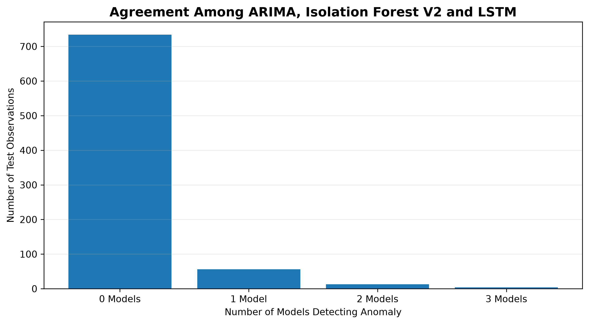

**Figure 12.** Distribution of anomaly detections according to the number of base models that agree. Most test observations are classified as normal by all three models, while a smaller subset receives one or more independent anomaly detections.
## 10.5 Relationship Between Single-Model Detections and Anomaly Windows

The single-model detections were also compared with the official NAB anomaly windows.

| Detection Type | Inside Official Window | Outside Official Window | Percentage Inside |
|---|---:|---:|---:|
| ARIMA only | 2 | 7 | 22.2% |
| Isolation Forest V2 only | 14 | 5 | 73.7% |
| LSTM Autoencoder only | 23 | 5 | 82.1% |

This provides an important insight into the different detection mechanisms.

A large proportion of the unique LSTM Autoencoder detections occurred inside official anomaly windows.

Similarly, most Isolation Forest V2-only detections were inside the anomaly windows.

In contrast, ARIMA-only detections had a lower proportion of observations inside the official windows.

This suggests that ARIMA may respond more strongly to short-term forecast deviations, including deviations that are not included in the broader official anomaly windows.

---

## 10.6 Agreement Strength and Window Alignment

The relationship between model agreement and official anomaly windows was also examined.

| Models Agreeing | Observations | Inside Official Window | Percentage Inside |
|---:|---:|---:|---:|
| 0 | 734 | 351 | 47.82% |
| 1 | 56 | 39 | 69.64% |
| 2 | 13 | 9 | 69.23% |
| 3 | 4 | 3 | 75.00% |

The results show that observations flagged by at least one model had a higher probability of occurring inside an official anomaly window than observations receiving no anomaly detection.

The three-model agreement category had 75% of its observations inside official windows.

However, only four observations belonged to this category.

Therefore, the 75% value should not be interpreted as a statistically strong estimate because of the very small sample size.

---

## 10.7 Complementary Behavior of the Models

The agreement analysis demonstrates that the models are complementary rather than identical.

### ARIMA Residual

ARIMA focuses on:

\[
\text{Actual Value} - \text{Forecasted Value}
\]

Therefore, it is particularly sensitive to abrupt deviations from expected behavior.

### Isolation Forest V2

Isolation Forest considers several features simultaneously, including:

- Current value
- Lagged values
- 24-hour rolling statistics
- Deviation from rolling mean
- Cyclical time features

It can therefore identify unusual combinations of temporal and statistical characteristics.

### LSTM Autoencoder

The LSTM Autoencoder learns temporal representations from sequences of observations.

An observation receives a high anomaly score when the learned model cannot reconstruct its temporal pattern accurately.

These different mechanisms explain why the models can disagree on individual observations.

---

## 10.8 Hybrid Model and Agreement

The Hybrid V1 and Hybrid V2 models combine anomaly evidence from the three base approaches.

The hybrid approach does not require all three models to agree.

Instead, it combines their continuous anomaly scores.

This allows a strong signal from one model to contribute to the final anomaly score even when the other models do not cross their individual thresholds.

This is an important difference between:

**Hard agreement**

and

**Soft score combination.**

Hard agreement considers binary decisions:

\[
0 \text{ or } 1
\]

Soft combination considers the magnitude of the anomaly scores.

Therefore, the hybrid models can preserve information about anomaly severity that would be lost by considering only binary predictions.

---

## 10.9 Anomaly Score Normalization

The individual anomaly scores have different numerical scales.

For example:

- ARIMA uses absolute forecast error.
- Isolation Forest produces an anomaly score based on its decision function.
- LSTM uses reconstruction error.
- Hybrid V2 produces a percentile-based combined score.

Directly averaging these raw scores would therefore be inappropriate.

The project uses normalization before combining the scores.

For Hybrid V1, each component was normalized relative to its training-derived threshold.

For Hybrid V2, percentile-based normalization was used.

The percentile transformation can be expressed conceptually as:

\[
S_i =
Percentile(score_i)
\]

where \(S_i\) represents the relative extremeness of the observation according to model \(i\).

The Hybrid V2 score is then obtained by combining the normalized component scores.

---
#### Figure 13: Anomaly Score Analysis

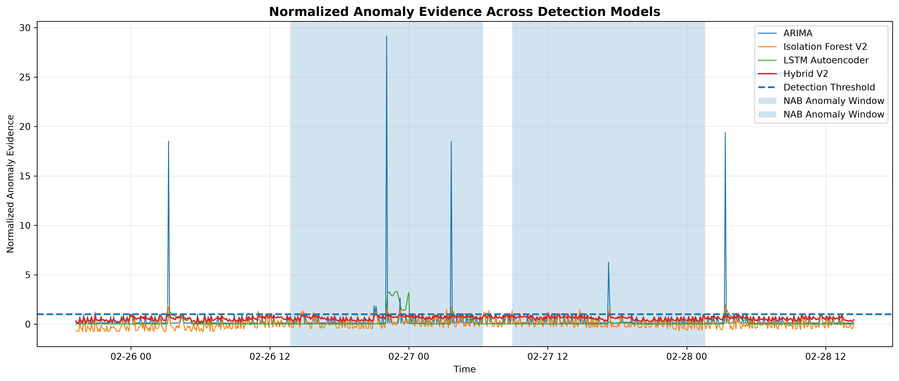

**Figure 13.** Normalized anomaly evidence produced by ARIMA, Isolation Forest V2, LSTM Autoencoder, and Hybrid V2 during the final test period. A value of 1 represents the respective detection threshold; values above 1 indicate observations exceeding that threshold. The scores are anomaly-evidence measures and should not be interpreted as calibrated probabilities.

## 10.10 Explainable Detection

The Streamlit dashboard provides an explanation for each detected anomaly.

For a detected timestamp, the dashboard reports:

- Actual observed value
- ARIMA anomaly evidence
- Isolation Forest anomaly evidence
- LSTM reconstruction error
- Hybrid anomaly score
- Number of base models detecting the observation
- Official anomaly-window status

This provides a simple form of model-level explainability.

For example, an observation can be interpreted as:

> Detected by ARIMA and Isolation Forest, but not by LSTM.

This indicates that the observation may represent a strong forecast deviation and an unusual feature-space observation without producing a sufficiently large reconstruction error.

Another observation may be detected only by the LSTM Autoencoder, suggesting that its temporal sequence contains an unusual pattern even though its individual statistical characteristics are not sufficiently extreme for the other models.

---

## 10.11 Score-to-Threshold Analysis

The dashboard also displays normalized anomaly evidence for the individual models.

For each model, the score is compared with its corresponding detection threshold.

A normalized value above:

\[
1.0
\]

indicates that the observation has exceeded the model's detection threshold.

The dashboard displays the magnitude of this exceedance without clipping the values.

This is useful because two observations may both be classified as anomalies but have very different anomaly severity.

For example:

\[
Score/Threshold = 1.1
\]

indicates a relatively small threshold exceedance, whereas:

\[
Score/Threshold = 5.0
\]

represents substantially stronger anomaly evidence.

These normalized values should be interpreted as anomaly evidence rather than probabilities.

---

## 10.12 Importance of Explainability

An anomaly detection system should ideally answer not only:

> **Which observation is anomalous?**

but also:

> **Why was it considered anomalous?**

The multi-model architecture provides several possible explanations.

An anomaly may be associated with:

- A large forecast error
- An unusual combination of lag and rolling features
- A large reconstruction error
- Agreement between multiple models
- A high hybrid anomaly score

This makes the system more useful for practical monitoring scenarios.

---

## 10.13 Limitations of Agreement Analysis

The agreement analysis has several limitations.

First, the models were developed using the same underlying time series, so their errors may not be completely independent.

Second, the three-model agreement category contains only four observations.

Third, agreement does not necessarily imply correctness.

Two models can agree on a false positive.

Similarly, an anomaly can be genuine even if only one model detects it.

Therefore, model agreement should be treated as supporting evidence rather than definitive ground truth.

---

## 10.14 Key Findings

The agreement analysis produced several important findings:

1. Most observations were classified as normal by all three base models.

2. LSTM Autoencoder produced the largest number of unique detections.

3. Isolation Forest V2 also identified many observations that were not detected by the other models.

4. A large proportion of LSTM-only and Isolation Forest-only detections occurred inside official anomaly windows.

5. Observations detected by at least one model were more likely to fall inside an official anomaly window.

6. The models therefore capture complementary aspects of abnormal time-series behavior.

7. Hybrid models can combine these complementary signals using continuous anomaly scores.

8. Agreement is useful for interpretation but should not be treated as a substitute for ground-truth evaluation.

---

## 10.15 Summary

Model agreement analysis strengthens the project by examining the behavior of the detectors beyond standard performance metrics.

The results demonstrate that statistical forecasting, machine learning, and deep learning approaches do not identify exactly the same observations.

This diversity is useful because each approach captures a different type of abnormality.

The explainability component of the Streamlit dashboard makes these differences visible and allows individual detections to be examined using their model-specific anomaly evidence.

Overall, the agreement analysis supports the use of a multi-model framework for understanding complex time-series anomalies.
# 11. Streamlit Application and System Deployment


## 11.1 Motivation

A major objective of the project was to make the experimental results accessible through an interactive interface rather than presenting them only through a Jupyter Notebook.

For this purpose, a web-based dashboard was developed using Streamlit.

The dashboard provides an interactive environment where users can examine:

- Time-series behavior
- Forecasting performance
- Anomaly detections
- Model performance
- Official anomaly windows
- Model agreement
- Anomaly score severity
- Individual detection explanations

The application therefore acts as the presentation and analysis layer of the complete time-series anomaly detection system.

---

## 11.2 Streamlit Architecture

The application follows the following workflow:

```text
Processed Dataset
       ↓
Processed Model Results
       ↓
Streamlit Application
       ↓
 ┌──────────────────────────┐
 │ Dataset Overview         │
 │ Forecasting Analysis     │
 │ Anomaly Detection        │
 │ Model Comparison         │
 │ Model Agreement          │
 │ Score Analysis           │
 │ Detection Explanation    │
 └──────────────────────────┘
       ↓
Interactive Visualization
#### Figure 15: Streamlit Interactive Dashboard


**Figure 15.** Interactive Streamlit dashboard developed for the proposed time-series forecasting and anomaly detection system. The dashboard provides model selection, analysis-period selection, forecasting results, anomaly detection visualization, model comparison, and explainability analysis.
# 12. Limitations, Challenges, and Future Work

## 12.1 Introduction

Although the project successfully demonstrates a multi-model time-series anomaly detection framework, several limitations remain.

These limitations arise from the characteristics of the dataset, the available ground-truth labels, the computational scope of the project, and the design of the current prototype.

Identifying these limitations is important because a research-oriented project should distinguish between experimental findings and claims that can be generalized to real-world systems.

---

# 12.2 Dataset Limitations

The primary experiments were performed on a single CPU-utilization time series from the Numenta Anomaly Benchmark.

Although the dataset provides a useful benchmark for anomaly detection, a single time series cannot represent all possible time-series behaviors.

Different real-world systems may contain:

- Strong seasonality
- Multiple seasonal patterns
- Trends
- Abrupt level changes
- Multiple correlated variables
- Missing observations
- Irregular sampling
- Changing statistical distributions

Therefore, the conclusions obtained from this dataset should not automatically be generalized to every time-series anomaly detection problem.

---

# 12.3 Limited Number of Anomaly Events

The final test period contains two major official anomaly windows.

Although this is sufficient for demonstrating the methodology, it is a relatively small number of events for drawing statistically strong conclusions about event-level performance.

For example, detecting both events results in a 100% event detection rate:

\[
\frac{2}{2}=100\%
\]

However, this does not imply that the model would necessarily detect 100% of anomaly events on a larger dataset.

Future experiments should evaluate the framework across many independent time series and a larger number of anomaly events.

---

# 12.4 Difference Between Point Labels and Anomaly Windows

One of the most important challenges in this project is the difference between exact anomaly labels and broader anomaly windows.

The exact point labels identify specific timestamps, while the official NAB windows represent extended periods of anomalous behavior.

As a result, a model may correctly identify abnormal behavior inside an official anomaly window but receive a false-positive classification under exact point-level evaluation.

Similarly, a model may identify only a few points inside a long anomaly window and therefore obtain low window recall even though it successfully detects the anomaly event.

This demonstrates that anomaly detection evaluation depends strongly on how ground truth is defined.

---

# 12.5 Threshold Selection Limitation

The anomaly thresholds were primarily based on the 99th percentile of training score distributions.

This provides a simple and leakage-safe thresholding strategy.

However, a fixed percentile threshold may not be optimal for every application.

Different applications may have different costs associated with:

- False positives
- False negatives
- Delayed detection
- Missed anomaly events

A production system could therefore require a threshold selection strategy based on operational requirements rather than a fixed percentile.

---

# 12.6 Forecasting Model Limitations

The ARIMA model provided strong forecasting performance compared with the Naive baseline.

However, the selected ARIMA model produced relatively stable forecasts and did not model the large abnormal spikes accurately.

This is not necessarily a weakness for anomaly detection.

In fact, the inability to follow extreme abnormal behavior can produce large residuals that are useful as anomaly signals.

Nevertheless, ARIMA is fundamentally a statistical forecasting model and may be insufficient for highly nonlinear or strongly multivariate systems.

Future work could investigate models such as:

- SARIMA
- Exponential Smoothing
- Prophet-style models
- Vector autoregression
- Gradient boosting
- Temporal convolutional networks
- Transformer-based forecasting models

---

# 12.7 Isolation Forest Limitations

Isolation Forest is effective for identifying unusual observations in feature space.

However, it does not explicitly model temporal dependencies in the same way as sequence-based deep learning approaches.

The temporal behavior is indirectly represented through engineered features such as:

- Lag values
- Rolling statistics
- Time-of-day features
- Day-of-week features

The quality of the detector therefore depends partly on the quality of feature engineering.

Future work could investigate more advanced temporal representations or online anomaly detection methods.

---

# 12.8 LSTM Autoencoder Limitations

The LSTM Autoencoder can learn temporal representations without requiring explicit anomaly labels during training.

However, deep learning introduces additional challenges.

These include:

- Higher computational requirements
- Hyperparameter sensitivity
- Dependence on training data quality
- More difficult interpretation
- Potential overfitting
- Sensitivity to sequence length

The selected sequence length in this project was 24 observations, corresponding to approximately two hours of data at a five-minute sampling interval.

Different sequence lengths may capture different temporal patterns.

Future experiments could compare multiple sequence lengths systematically.

---

# 12.9 Hybrid Model Limitations

The hybrid models combine anomaly evidence from multiple detectors.

Although this provides a useful ensemble perspective, the hybrid approach does not automatically outperform the best individual model.

This was directly observed in the experimental results.

For example, the LSTM Autoencoder achieved a higher window F1-score than both Hybrid V1 and Hybrid V2.

Similarly, ARIMA achieved the highest point-level F1-score and ROC-AUC.

Therefore, simple score averaging should not be assumed to be optimal.

More advanced ensemble strategies could be investigated.

Possible approaches include:

- Weighted score combination
- Learned ensemble weights
- Stacking
- Meta-classifiers
- Adaptive thresholds
- Context-aware weighting
- Bayesian model combination

---

# 12.10 Computational Limitations

The project was developed within the computational resources available on a personal laptop.

This was sufficient for:

- ARIMA experimentation
- Isolation Forest
- LSTM Autoencoder training
- Visualization
- Streamlit deployment

However, larger datasets and more complex deep learning architectures may require:

- GPU acceleration
- Distributed computation
- Cloud infrastructure
- Larger memory capacity

Therefore, scalability was not the primary focus of the current implementation.

---

# 12.11 Lack of Real-Time Data

The current system operates on a fixed historical dataset.

The application does not currently ingest a continuously changing data stream.

As a result, the current system demonstrates the complete analytical pipeline but does not yet provide real-time anomaly detection.

A real-world monitoring system would require:

1. Continuous data ingestion
2. Online preprocessing
3. Rolling feature computation
4. Real-time forecasting
5. Real-time anomaly scoring
6. Alert generation
7. Dashboard updates

---

# 12.12 Lack of Automated Retraining

The current system does not automatically retrain its models when the underlying data distribution changes.

In real systems, the statistical characteristics of a signal may change over time.

This phenomenon is commonly referred to as concept drift or distribution shift.

For example, normal CPU utilization patterns may change because of:

- Changes in workload
- Software updates
- Infrastructure changes
- User behavior
- Scaling operations

A future version could periodically evaluate model performance and retrain the models when significant distribution changes are detected.

---

# 12.13 Explainability Limitations

The project provides model-level explanations based on anomaly scores and model agreement.

However, these explanations do not fully explain the internal decision process of the LSTM Autoencoder or Isolation Forest.

For example, a high LSTM reconstruction error indicates that the sequence was difficult for the model to reconstruct, but it does not directly identify which internal representation caused the error.

Future work could investigate more advanced explainability methods such as:

- SHAP
- Feature permutation importance
- Attention visualization
- Counterfactual analysis
- Local surrogate models

---

# 12.14 Future Work: Multiple Datasets

A major future direction is to evaluate the proposed framework across multiple time-series datasets.

Potential datasets could represent:

- Cloud infrastructure
- Network traffic
- Industrial sensors
- IoT devices
- Energy consumption
- Financial signals
- Server monitoring

Testing across multiple domains would provide stronger evidence about the generalizability of the proposed framework.

---

# 12.15 Future Work: Multivariate Time Series

The current primary experiment focuses on a single CPU-utilization variable.

Real-world monitoring systems often contain multiple related variables.

For example, a cloud server could simultaneously provide:

- CPU utilization
- Memory utilization
- Disk usage
- Network traffic
- Request rate

A multivariate extension could model relationships among these variables.

This could allow the system to detect anomalies that are not obvious from any single variable.

---

# 12.16 Future Work: Advanced Deep Learning

The LSTM Autoencoder provides a foundation for more advanced sequence models.

Future experiments could investigate:

- Bidirectional LSTM
- GRU Autoencoders
- Variational Autoencoders
- Temporal Convolutional Networks
- Transformer-based models
- Attention-based Autoencoders

These models could potentially capture more complex temporal relationships.

However, increased model complexity should be justified by measurable improvements rather than used solely for complexity.

---

# 12.17 Future Work: Real-Time Monitoring

The current Streamlit application could be extended into a real-time monitoring platform.

A possible future architecture is:

```text
Live Data Source
       ↓
Streaming Data Ingestion
       ↓
Preprocessing
       ↓
Feature Generation
       ↓
Forecasting
       ↓
Anomaly Detection
       ↓
Hybrid Scoring
       ↓
Alert Engine
       ↓
Streamlit Dashboard
# 13. Conclusion

## 13.1 Project Summary

This project presented a multi-model framework for time-series forecasting and anomaly detection using statistical, machine learning, deep learning, and hybrid approaches.

The primary objective was to study how different modeling techniques behave when applied to abnormal patterns in a real-world time series.

The Numenta Anomaly Benchmark (NAB) was used as the primary dataset, with Amazon EC2 CPU utilization selected as the experimental time series.

The complete system consisted of:

1. Data preprocessing
2. Exploratory time-series analysis
3. Statistical forecasting
4. Forecast residual-based anomaly detection
5. Machine learning-based anomaly detection
6. Deep learning-based anomaly detection
7. Hybrid anomaly detection
8. Multi-level evaluation
9. Model agreement analysis
10. Explainability
11. Interactive Streamlit visualization

---

## 13.2 Major Findings

The exploratory analysis showed that the CPU-utilization series was highly right-skewed and contained extreme values associated with anomalous behavior.

The Augmented Dickey-Fuller test indicated that the series was stationary, supporting the use of ARIMA without differencing.

The Naive forecasting baseline achieved:

- MAE = 0.050979
- RMSE = 0.175173

The selected ARIMA(1,0,0) model achieved:

- MAE = 0.031119
- RMSE = 0.123077

This corresponds to approximately 39.0% improvement in MAE and 29.8% improvement in RMSE relative to the Naive baseline.

These results demonstrate that even a relatively simple statistical forecasting model can provide a useful representation of expected time-series behavior.

---

## 13.3 Anomaly Detection Findings

The anomaly detection experiments showed that different modeling approaches capture different characteristics of abnormal behavior.

### ARIMA Residual

ARIMA residual-based detection achieved the highest point-level F1-score:

\[
F1 = 0.1600
\]

and the highest ROC-AUC:

\[
ROC-AUC = 0.9981
\]

It also detected both major anomaly events.

This demonstrates that forecasting error can be a powerful anomaly signal when abnormal observations deviate strongly from expected behavior.

### Isolation Forest V2

Isolation Forest V2 improved substantially over its first version after introducing improved temporal and cyclical features.

It achieved:

\[
Window\ F1 = 0.1187
\]

and detected both major anomaly events.

This demonstrates the importance of feature engineering when applying general-purpose machine learning anomaly detectors to time-series data.

### LSTM Autoencoder

The LSTM Autoencoder achieved the highest window-level F1-score:

\[
Window\ F1 = 0.1327
\]

and the highest window precision:

\[
Precision = 0.8286
\]

However, it detected only one of the two major anomaly events.

This demonstrates that deep learning can produce highly concentrated anomaly detections while still being sensitive to the characteristics of individual anomaly events.

### Hybrid Approaches

The hybrid models combined evidence from ARIMA, Isolation Forest V2, and the LSTM Autoencoder.

Hybrid V2 achieved:

\[
ROC-AUC = 0.9950
\]

and successfully detected both major anomaly events.

However, neither hybrid approach outperformed the best individual model across every metric.

This is an important result because it demonstrates that increasing model complexity does not automatically guarantee better performance.

---

## 13.4 Importance of Multi-Level Evaluation

One of the key contributions of the project was the use of multiple evaluation perspectives.

The models were evaluated using:

- Point-level metrics
- Window-level metrics
- Event-level detection

This was necessary because the exact point labels and official anomaly windows represent different interpretations of anomalous behavior.

The results demonstrated that a model can have low window recall while still successfully detecting an anomaly event.

Therefore, anomaly detection performance should be interpreted according to the operational objective of the system.

---

## 13.5 Research Questions and Answers

The project began with several research questions.

### RQ1: How effectively can statistical methods detect anomalies in time-series data?

Statistical forecasting residuals were highly effective at ranking anomalous observations.

ARIMA Residual achieved a ROC-AUC of 0.9981 and detected both major anomaly events.

Therefore, statistical forecasting provides a strong baseline for anomaly detection.

---

### RQ2: Does forecasting-based anomaly detection outperform simple statistical approaches?

The forecasting-based ARIMA residual approach provided strong anomaly ranking performance.

The residual represents the difference between observed and expected behavior:

\[
Residual_t = y_t - \hat{y}_t
\]

Large residuals therefore provide a natural anomaly signal.

The results demonstrate that forecasting can be effectively transformed into an anomaly detection mechanism.

---

### RQ3: How do machine learning methods compare with forecasting-based detection?

Isolation Forest V2 achieved strong window-level performance and detected both anomaly events.

However, ARIMA Residual achieved higher point-level F1 and ROC-AUC.

Therefore, neither approach universally dominates the other.

The comparison shows that machine learning provides complementary information rather than simply replacing statistical forecasting.

---

### RQ4: Can deep learning improve detection of complex temporal patterns?

The LSTM Autoencoder achieved the highest window-level F1-score among the evaluated approaches.

This suggests that sequence-based deep learning can capture temporal patterns that are useful for anomaly detection.

However, the model detected only one of the two major anomaly events.

Therefore, deep learning showed potential but did not universally outperform the simpler approaches.

---

### RQ5: Can combining forecasting errors with machine learning and deep learning scores improve anomaly detection?

The hybrid approaches successfully combined information from different detection mechanisms and achieved 100% event detection.

However, simple score averaging did not produce the best performance for every metric.

Therefore, hybrid modeling is useful for combining complementary evidence, but the ensemble strategy itself requires careful design.

---

## 13.6 Main Contribution of the Project

The primary contribution of this project is not the development of a single new anomaly detection algorithm.

Instead, the project provides a systematic experimental framework for comparing different anomaly detection philosophies on the same time-series data.

The framework combines:

```text
Statistical Forecasting
        +
Machine Learning
        +
Deep Learning
        +
Hybrid Scoring
        +
Multi-Level Evaluation
        +
Explainability
        +
Interactive Visualization
# 14. References

1. Ahmad, S., Lavin, A., Purdy, S., and Agha, Z. (2017). Unsupervised Real-Time Anomaly Detection for Streaming Data. *Neurocomputing*, 262, 134–147.

2. Numenta. *Numenta Anomaly Benchmark (NAB)*. GitHub Repository.  
   https://github.com/numenta/NAB

3. Numenta. *Numenta Anomaly Benchmark — Data and Anomaly Labels*.  
   https://github.com/numenta/NAB/tree/master/data

4. Box, G. E. P., Jenkins, G. M., Reinsel, G. C., and Ljung, G. M. (2015). *Time Series Analysis: Forecasting and Control*. Wiley.

5. Hyndman, R. J., and Athanasopoulos, G. (2021). *Forecasting: Principles and Practice*. OTexts.

6. Liu, F. T., Ting, K. M., and Zhou, Z.-H. (2008). Isolation Forest. *2008 Eighth IEEE International Conference on Data Mining*, 413–422.

7. Hochreiter, S., and Schmidhuber, J. (1997). Long Short-Term Memory. *Neural Computation*, 9(8), 1735–1780.

8. Malhotra, P., Ramakrishnan, A., Anand, G., Vig, L., Agarwal, P., and Shroff, G. (2016). LSTM-based Encoder-Decoder for Multi-sensor Anomaly Detection. arXiv preprint arXiv:1607.00148.

9. TensorFlow. *TensorFlow Documentation*.  
    https://www.tensorflow.org/

10. Scikit-learn. *Scikit-learn Documentation*.  
    https://scikit-learn.org/

11. Statsmodels. *Statsmodels Documentation*.  
    https://www.statsmodels.org/

12. Streamlit. *Streamlit Documentation*.  
    https://docs.streamlit.io/

13. McKinney, W. (2010). Data Structures for Statistical Computing in Python. *Proceedings of the 9th Python in Science Conference*, 56–61.

14. Hunter, J. D. (2007). Matplotlib: A 2D Graphics Environment. *Computing in Science & Engineering*, 9(3), 90–95.      